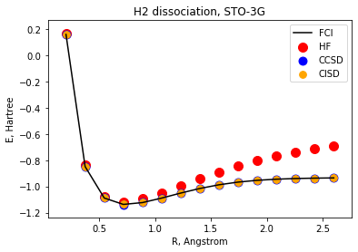
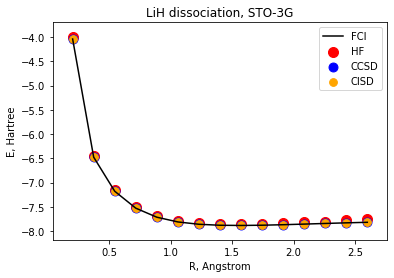
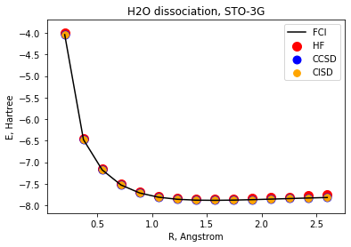
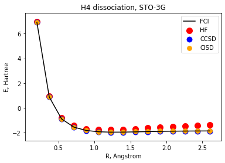
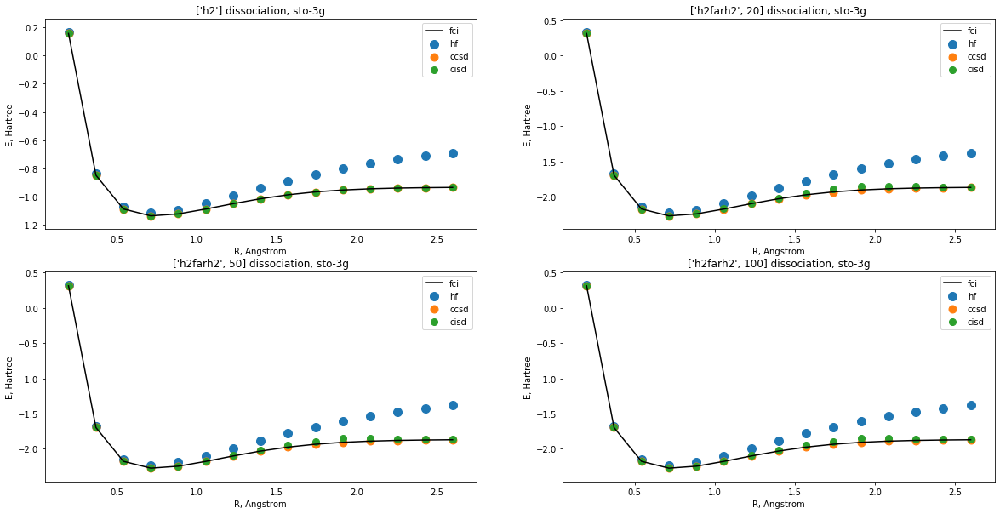
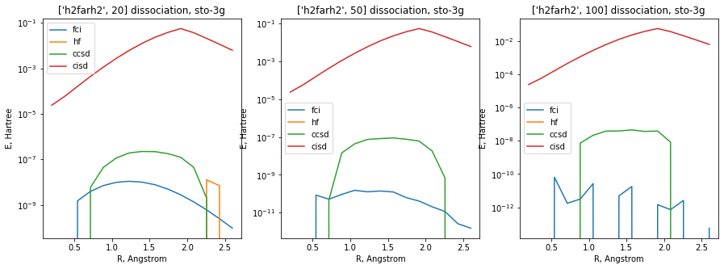
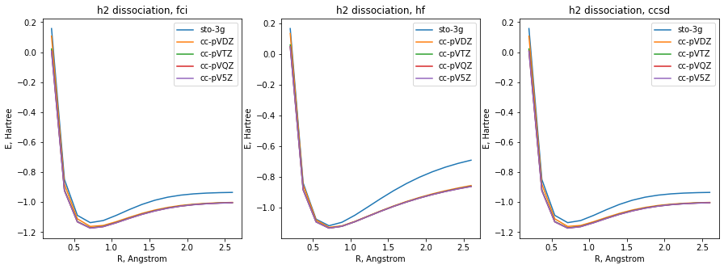
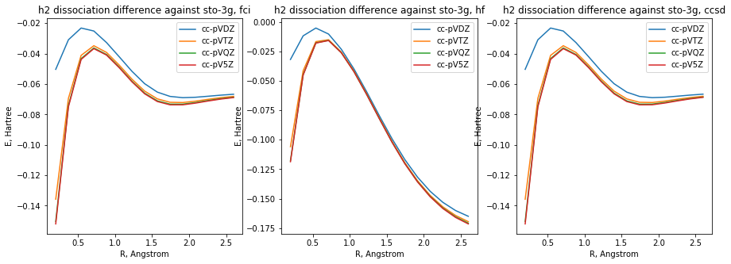
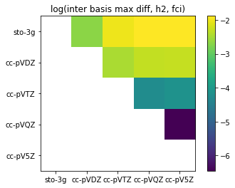
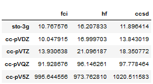

## Project 3: VQE: Constructing potential energy surfaces for small molecules

This project will guide you through the state-of-the-art techniques for solving electronic structure problems on NISQ computers.

Open up [instructions.pdf](https://github.com/CDL-Quantum/CohortProject_2021/tree/main/Week3_VQE/Instructions.pdf) to begin learning about your tasks for this week!

**Please edit this markdown file directly with links to your completed tasks and challenges.**

## Tasks 

### Task 1 : classical simulation

#### Question 1
We generated potential energy surfaces on the sto-3g basis for several moldecules using classical methods. The classical methods include variational methods such as Hartree-Fock (HF), Configuration Interaction Singles and Doubles (CISD),  and the exact answer within the chosen basis Full Configuration Interaction (FCI) and non-variational methods such as Coupled Cluster Singles and Doubles (CCSD). The molecules on which we tested the above methods are H2, H2O, H4, LiH, N2 and NH3.

Weak interaction

<table><tr>
    <td></td> 
    <td></td>
    </tr>
</table>

Strong interaction

<table><tr>
    <td></td> 
    <td></td>
    </tr>
</table>

#### Question 2
We checked the separability of exact solving FCI and approximate methods HF, FCI and CCSD. In order to do that we placed two H2 molecules far from each other (20, 50 and 100 A) and compared the computes energy against twice the enrgy of a single H2. the difference of energy as a function of the bonds can be seen below.

Below is a plot of the PES of the H2 molecule, followed by plots of PES for two H2 molecules apart respectivelu 20, 50 and 100A

Below is a plot of the log of the difference of PES between two H2 molecules incresingly apart and twice the PES of a single H2 molecule. The least seprable method is CCISD, while FCI is perfectly seperable.

#### Question 3
For the above benchmarks we used the simple basis sto-3g, which is a  minimal basis set, where 3 primitive Gaussian orbitals are fitted to a single Slater-type orbital (STO). However other more complex basis exist such as cc-pVDZ,cc-pVDZ,cc-pVTZ,cc-pVQZ and cc-pV5Z. We benchmarked these basis for some methods (HF,CCSD,FCI) on the simplest molecule H2.

The graph belows shows a comparaison of potential energy surfaces  between basis for each method. The sto stands out as yielding the most different results.

The graph belows shows the difference of potential energy surfaces between the CC basis and sto basis for each method. The HF methods stands out as showing different results.

The graph belows shows the logarithm of the maximum inter basis difference of potential energy surfaces, in other words the Hinfinity distance on the considered bond distance range between each pair of basis for the  FCI method. For example cc-PV5Z has a difference of 10^-2 with the sto-3g basis. The basis are ordered in increasing ability to model reality, and chances to be close to experiments.

The table below shows the times that each computation has taken for the H2 molecule, together with the precision matrix above, it can help to do a trade off between the time to compute and the precision needed.

### Task 2
* Generating the qubit Hamiltonian.
* Unitary transformations.
* Hamiltonian measurements.
* Use of quantum hardware.

## Further Challenges:
* How to obtain excited electronic states of the same or different symmetry?
* Partitioning in the fermionic operator space.
* Applying unitary transformations on the Hamiltonian.
* Compress larger basis sets into smaller number of qubits.

## Business Application
For each week, your team is asked to complete a Business Application. Questions you will be asked are:

* Explain to a layperson the technical problem you solved in this exercise.
* Explain or provide examples of the types of real-world problems this solution can solve.
* Identify at least one potential customer for this solution - ie: a business who has this problem and would consider paying to have this problem solved.
* Prepare a 90 second video explaining the value proposition of your innovation to this potential customer in non-technical language.

For more details refer to the [Business Application found here](./Business_Application.md)
