## Project 3: VQE: Constructing potential energy surfaces for small molecules

# Task 1: Generating PES

<!-- The first task we were assigned with was to run PES calculations for $H_2$ and $H_2O$ molecules using popular quantum chemistry methods such Hartree-Fock (HF), Configuration Interaction Singles and Doubles (CISD), Coupled Cluster Singles and Doubles (CCSD), and Full Configuration Interaction (FCI), in the minimal STO-3G basis.
Subsequently we were asked to compute similar curves for other molecules $H_4$, $LiH$, $N_2$, and $NH_3$. -->

The first task we were assigned with was to run PES calculations for *H*2 and *H*2*O* molecules using popular quantum chemistry methods such Hartree-Fock (HF), Configuration Interaction Singles and Doubles (CISD), Coupled Cluster Singles and Doubles (CCSD), and Full Configuration Interaction (FCI), in the minimal STO-3G basis. Subsequently we were asked to compute similar curves for other molecules *H*4, *L**i**H*, *N*2, and *N* *H*3. 

<table>
        <tr>
            <td></td>
            <td></td>
        </tr>
        <tr>
            <td></td>
            <td></td>
        </tr>
        <tr>
            <td></td>
            <td></td>
        </tr>
</table>

*Q: Among classical methods, there are techniques based on the variational approach and those
that are not. Identify variational methods among those that were used and explain advantages of
the variational approach. Are there any arguments for using non-variational techniques?*

<table align="center">
    <tr>
        <td> <b>Method</b> </td>
        <td> <b>Type</b> </td>
    </tr>
    <tr>
        <td> HF </td>
        <td> Variational </td>
    </tr>
    <tr>
        <td> CISD </td>
        <td> Variational </td>
    </tr>
    <tr>
        <td> CCSD </td>
        <td> Not Variational </td>
    </tr>
    <tr>
        <td> FCI </td>
        <td> Exact </td>
    </tr>
</table>

One of the main advantages of a variational method is that is that the energy obtained from such a method is guaranteed to be bounded from below by the exact energy. Provided we are not very far away from the exact energy, we may thus get a sense of the quality of the ansatz that can be systematically improved. 

Non-variational techniques like CCSD can still be very powerful to study systems as they might be cheaper than their variational counterparts. This enables us to access larger number of orbitals which might be essential to capture properties of the system of interest. In some instances, like CCSD, they can be also be systematically improved by incorporating highter order excitations directly (for. e.g. CCSDT, CCSDTQ) or indirectly/perturbatively (e.g. CCSD(T)). It is worth noting that despite not being variational, Coupled Cluster methods have been very accurate and is considered the "gold standard" for computational chemistry. 

*Q: Optional: There is another division between classical methods, it is based on so-called sep-
arability or size-consistency. Simply speaking, if one investigates two molecular fragments (A and
B) at a large distance from each other (∼ 100 Å) then the total electronic energy should be equal
to the sum E A+B = E A + E B , where the energy of each fragment (E A or E B ) can be obtained in a
calculation that does not involve the other fragment. If this condition is satisfied for a particular
method, this method is separable or size-consistent. Check separability of HF, CISD, and CCSD
by taking 2 H 2 fragments at a large distance from each other and comparing the total energy with
2 energies of one H 2 molecule. Explain your results.*

<table  align="center">
    <tr>
        <td>
            <table>
                <tr>
                    <td> <b>Method</b> </td>
                    <td> <b>Type</b> </td>        
                </tr>
                <tr>
                    <td> HF </td>
                    <td> Size-consistent </td>
                </tr>
                <tr>
                    <td> CISD </td>
                    <td> Not size-consistent </td>
                </tr>
                <tr>
                    <td> CCSD </td>
                    <td> Size-consistent </td>
                </tr>
            </table>
        </td>
        <td>
            
        </td>
    </tr>    
</table>

Both CCSD and HF are size-consistent whereas CISD is not. This is due to the truncation of the excitations in CISD to only doubles. To elaborate: since we are allowing double excitations of the (*H*2) monomers this means that when we put two monomers together there is the possibility of two simultaneous double excitations (for an effective quadrapule excitation). However, since CISD restricts excitations only to doubles we are removing that possibility. As a result the energy of the 2 monomers together is always larger than double the energy of one monomer. HF doesn't have this problem since it is an effective single particle theory and energies are additive. CISD fully accounts for all possible excitations in the constituent electrons at the doubles level (allowing for simultaneous excitations) and, thus, doesn't have size-consisteny issues.

*Q: Optional: If one is interested in converging to the exact non-relativistic electronic energies,
there are two independent coordinates: 1) accuracy of accounting for many-body effects beyond
the Hartree-Fock method (electronic correlation) and 2) accuracy of representation of one-electron
states, or convergence with respect to the one-electron basis size. Convergence along the first
coordinate can be illustrated by monitoring reduction of the energy deviations from the Full CI
answer in a particular basis set for a series of increasingly accurate approaches, e.g. HF, CCSD,
CCSD(T), CCSDT. Convergences along the second coordinate requires the basis set extension from
STO3G to a series like cc-pVDZ, cc-pVTZ, cc-pVQZ, cc-pV5Z. Explore for a small system like H 2
both convergences. Which energies should be expected to be closer to experimentally measured
ones?*

<table  align="center">
    <tr>
        <td>
            
        </td>
        <td>
            
        </td>
    </tr>
</table>

The standard quantum chemistry canon is shown in the figure above (left). So we should expect to see that same as we monitor *H*2. In paricular in the large basis and higher electron correlation energy accounting limit we should obtain answers that are in agreement with experiment. Our intuition is corraborated by the figure (right) and we see that as we increase our ability to capture electron correlation and size of the basis, we approach experimental values. <!--Note with CCPV5Z and experiment is $|\Delta E| \sim 0.45$ $mE_h$, which is within chemical accuracy.--> Note that for CCPV5Z and experiment,  \|*Δ* *E*\| ∼ 0.45*m* *E**h*, which is within chemical accuracy.

# Task 2: Generating Qubit Hamiltonian

Note that in the STO-3G basis, the *H*2 molecule has 4 spin orbitals (2 spin orbitals x 2 atoms) and 2 electrons. <!--Each spin orbital can have at most 2 possibilties, viz., occupied or unoccupied. Therefore we have a total Hilbert space of size $2^4 = 16$ configurations. This is evident from the output of the code where the size is truncated to 15, since the vacant configuration with total number of electrons ($N_e = 0$) can be eliminated. -->Each spin orbital can have at most 2 possibilities, viz., occupied or unoccupied. Therefore we have a total Hilbert space of size 24 = 16 configurations. This is evident from the output of the code where the size is truncated to 15, since the vacant configuration with total number of electrons (*N**e* = 0) can be eliminated.

*Q: What are the requirements for a function of qubit operators to be a valid mapping for the fermionic operators?*

<!-- In order to be a valid mapping we have ensure that the function is anti-commuting with respect to the operators as Fermionic operators are fundamentally anti-commuting in nature, .i.e., for two Fermionic operators $\hat{q}_1$, $\hat{q}_2$ and for some function, *f()*, $f(\hat{q}_1, \hat{q}_2) = -f(\hat{q}_2, \hat{q}_1)$. -->
In order to be a valid mapping we have ensure that the function is anti-commuting with respect to the operators as Fermionic operators are fundamentally anti-commuting in nature, .i.e., for two Fermionic operators *q̂*1, *q̂*2 and for some function, *f()*, *f*(*q̂*1,*q̂*2) =  − *f*(*q̂*2,*q̂*1).

*Q: The electronic Hamiltonian is real (due to time-reversal symmetry), what consequences does that have on the terms in the qubit Hamiltonian after the Jordan-Wigner transformation?*

Once we Fermionize the Hamiltonian it must be that case that the Hamiltonian is symmetric.

*Q: What are the cons and pros of the Bravyi-Kitaev (BK) transformation compared to the
Jordan-Wigner (JW) transformations?*

As pointed out by Tranter et al. in [[1]](https://arxiv.org/abs/1812.02233) generall speaking BK transformation is better than JW in terms of reducing gate count. This is most pronounced for unoptimized circuits up to 30 qubits. The benefits are around 25% for systems with 50 qubits. Using optimized Trotter ordering diminishes the advantages of BK considerably and even leads to JW tranformations to produce slighly shorter circuit in some cases. It is vital to note that one of the most important benefits of BK transformation is to reduce the number of expensive entangling gate count.

From an error point of view, BK transformation appears to also produce slightly better Trotter errors. There are notable exceptions, however, and the authors warn against using BK optimization in magnitude ordering schemes. They also suggest that the performance in case dependent and requires a careful and comprehensive numerical evaluation. 

# Task 3: Unitary Transformations

<!--*Q: Standard Hamiltonian symmetries are i) number of electrons $\hat{N}_e = \sum_k \hat{a}^\dagger_k \hat{a}_k$ , ii) electron spin $\hat{S}^2$, iii) electron spin projection $\hat{S}_z$, iv) time-reversal symmetry, and v) point-group symmetry for
symmetric molecules. Which of these symmetries are conserved in a) UCC and b) QCC ?*-->
*Q: Standard Hamiltonian symmetries are i) number of electrons *N̂**e* = ∑*k**â**k*†*â**k*, ii) electron spin *Ŝ*2, iii) electron spin projection *Ŝ**z*, iv) time-reversal symmetry, and v) point-group symmetry for symmetric molecules. Which of these symmetries are conserved in a) UCC and b) QCC?*

Both methods preserve time-reversal symmetry by construction. 

<!--a) UCC preserves particle number and $\hat{S}_z$ symmetry. Electron spin symmetry can be incorporated but can be expensive. Point group symmetries can also be incorporated. -->
a) UCC preserves particle number and *Ŝ**z* symmetry. Electron spin symmetry can be incorporated but can be expensive. Point group symmetries can also be incorporated. 

<!--b) Generally QCC can break particle number symmetry, $\hat{S}^2$ as well as $\hat{S}_z$ symmetries. Naturally this means that point-group symmetry for symmetric molecules can also be broken.-->
b) Generally QCC can break particle number symmetry, *Ŝ*2 as well as *Ŝ**z* symmetries. Naturally this means that point-group symmetry for symmetric molecules can also be broken.

<!--*Q: Why symmetries are helpful for constructing a unitary operator which rotates the initial state $|\tilde{0}\rangle$ to the eigenstate $|\hat\psi\rangle$?*-->
*Q: Why symmetries are helpful for constructing a unitary operator which rotates the initial state |*Õ*⟩ to the eigenstate |*ψ̂*⟩?*

Symmetries essentially help in confining the Hamiltonian into a smaller subspace which helps in computations by reducing the size of the problem. Additionally, in the nomenclature of Lie Algebras, in order to span the entire subspace of interest, the closure relations require all operators to be included within the group. This inadvertently leads to an explosion in the number of operators needed. Symmetries can be used to significantly reduce the number of operators needed for closure.

*Q: What are the ways to restore symmetries if your unitary transformation break them?*

There are two ways of restoring symmetry:
1) By incorporating the symmetry of interested directly into the variational estimator as constraints:
    <!--$$F[\psi] = \langle \psi| \hat{H} - \lambda (\hat{S}-S)^2|\psi\rangle$$
    Here, $\lambda$ is a Lagrange multiplier, S is the desired symmetry sector and $\hat{S}$ is the desired symmetry operator.-->

    
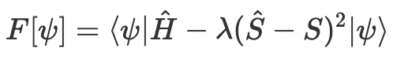

    Here, λ is a Lagrange multiplier, S is the desired symmetry sector and Ŝ is the desired symmetry operator.
    
2) By using projectors that project the unsymmetrized wave function  into the desired symmetry sub-space. So that the energy estimator becomes:
    <!--$$F[\psi] = \frac{\langle\psi|\hat{P}^\dagger \hat{H} \hat{P}|\psi\rangle}{\langle \psi|\hat{P}^\dagger\hat{P}|\psi\rangle},$$-->

    
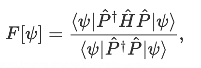

    <!-- where $\hat{P}$ is the projector and $\hat{P}^\dagger$ is the adjoint. Note that $\hat{P}$ is generally not Hermitian.  -->
    where *P̂* is the projector and *P̂*† is the adjoint. Note that *P̂* is generally not Hermitian.

# Task 4: Hamiltonian Measurements

* First we prove the inequality for the optimal splitting.
Starting with:
<!-- $$ 
(\langle \psi|  \hat{H} |\psi\rangle - \bar{H})^2 \le \sum_n \left(\frac{\sigma^2_{H_n}}{N_n}\right)\\ 
(\langle \psi|  \hat{H} |\psi\rangle - \bar{H})^2 \le \frac{1}{N_T}\sum_n \left(\frac{\sigma^2_{H_n}}{N_n/N_T}\right) 
$$ -->

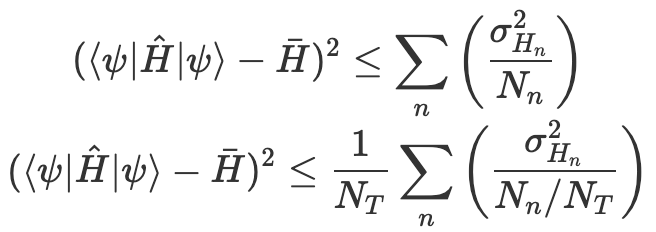

<!-- let $x_n \equiv N_n/N_T$ for convenience. We will try to minimize the function: -->
let *x**n* ≡ *N**n*/*N**T* for convenience. We will try to minimize the function:

<!-- $$f(\vec{x}) \equiv \sum_n \frac{\sigma^2_{H_n}}{x_n} + \lambda\left(\sum_n x_n - 1\right),$$ -->

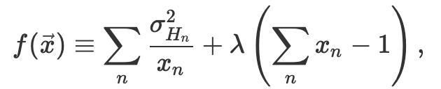

<!-- with $\vec{x} = \sum x_n |n\rangle$ and subjected to the constraint $\sum_n x_n = 1$. Since the minima is located at $\nabla f(\vec{x}) = 0$, we obtain the following set of equations for any $n$: -->

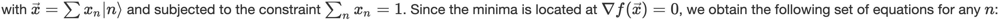

<!-- $$
    -\frac{\sigma^2_{H_n}}{x_n^2} + \lambda = 0
$$ -->

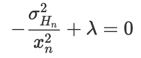

and
<!-- $$
    \sum_n x_n - 1 = 0
$$ -->

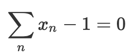

<!-- substituting for $x_n = \frac{\sqrt{\sigma^2_{H_n}}}{\sqrt{\lambda}}$ into the last equation we obtain $\lambda = (\sum_n \sqrt{\sigma^2_{H_n}})^2$ which immediately gives us the optimal $x_n = \frac{\sqrt{\sigma^2_{H_n}}}{\sum_n \sqrt{\sigma^2_{H_n}}}$ and at these optimal values we get: -->
substituting for 

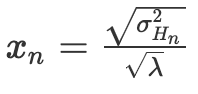

into the last equation we obtain 

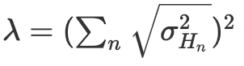

which immediately gives us the optimal 

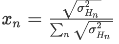

and at these optimal values we get:
<!-- $$
    f(\vec{x}) = (\sum_n \sqrt{\sigma^2_{H_n}})^2
$$ -->

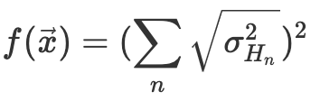

then we get for our inequality at the optimal split:
<!-- $$
(\langle \psi|  \hat{H} |\psi\rangle - \bar{H})^2 \le \frac{\left(\sum_n \sqrt{\sigma^2_{H_n}}\right)^2}{N_T} 
$$ -->

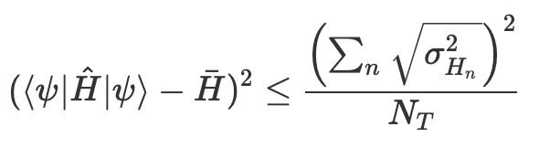

and the final inequality becomes:

<!-- $$
|\langle \psi|  \hat{H} |\psi\rangle - \bar{H}| \le 
\frac{\sum_n \sqrt{\sigma^2_{H_n}}}{\sqrt{N_T}} 
$$ -->

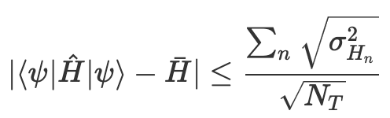

<!-- * For the optimal splitting we obtained $x_n = N_n/N_T = \frac{\sqrt{\sigma^2_{H_n}}}{\sum_n \sqrt{\sigma^2_{H_n}}} \implies N_n = N_T \frac{\sqrt{\sigma^2_{H_n}}}{\sum_n \sqrt{\sigma^2_{H_n}}}$ -->
* For the optimal splitting we obtained

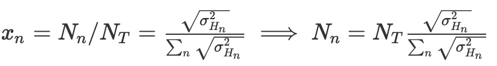

* Next we compute the number of measurements needed for the model systems:
It is evident from the equations above that for a target error *ϵ**T*, the requisite number of total samples is:
<!-- $$
    N_T = \frac{(\sum_n \sqrt{\sigma_{H_n}^2})^2}{\epsilon_T^2}
$$ -->

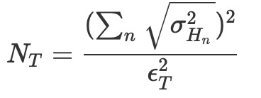

Therefore, we have to compute *σ*H*n* using the required fragment decompositions and HF solutions. Please refer to [S1_Exercise.ipynb](S1_Exercise.ipynb) for the actual calculations. Below we summarize the results.

<table align="center">
    <tr >
        <td> <b> Molecule </b> </td>
        <td> <b> NT for ϵ=1.0 mEh (QWC)</b> </td>
        <td> <b> NT for ϵ=1.0 mEh (FC) </b></td>
    </tr>
    <tr>
        <td> H2 (rtheta = 0.741)</td>
        <td> 31,208</td>
        <td> 32,929</td>
    </tr>
    <tr>
        <td> H4 (rtheta = 25o) </td>
        <td> 507,045 </td>        
        <td> 172,574 </td>
    </tr>    
</table>

* NT requirements for measuring *Ĥ* as a single operator: 
    <!-- In this case we see that since $H|\psi\rangle = E_0|\psi\rangle$ and $\langle\psi|H = E_0\langle\psi|$ (by Herimiticty), 
    $$\begin{align}
    \sigma_H^2 &= \langle\psi|\hat{H}^2|\psi\rangle - \langle\psi|\hat{H}|\psi\rangle^2\\
    &= \langle\psi|\hat{H}\hat{H}|\psi\rangle - E_0^2\\
    &= E_0^2 - E_0^2 = 0
    \end{align}
    $$ -->
    

    Therefore NT = 1 would be good enough to get the exact answer. This is of course assuming that we are able to prepare the exact eigenfunction |ψ⟩, free of any errors. Note that this zero variance property is true for any eigenstate of the Hamiltonian.

# Task 5: Use of Quantum Hardware

<table align="center">
    <tr>
        <td> 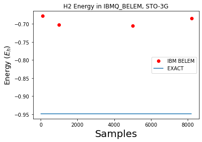</td>
        <td> 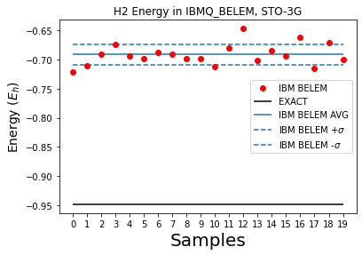</td>
    </tr>
    <tr>
        <td align="center"> (a) </td>
        <td align="center"> (b) </td>
    </tr>
</table>

We were able to run the VQE program on IBM's Belem machine  which has 5 qubits and quantum volume of 32. We simulated a *H*2 molecule at a bond length of *r* = 2 *A*∘. The figure to the left (a) shows results for a single bin of different samples sizes. The figure to the right (b) shows results for 20 bins each of which is computed using 1000 samples.

*Q: Implement an error-mitigation protocol based on removing measurement results correspond-
ing to a wrong number of electrons, which is described in Ref. [14](see Sec. 3.4. Post-processing*

Please refer to our file [S5_Circuits-Exercise.ipynb](S5_Circuits-Exercise.ipynb) for details on the implementation. The projector operator is given by:
<!-- $$ \hat{P}_N = \frac{1}{L} \sum_{l=0}^{L-1} \exp\left(-i\frac{2\pi l}{L}N\right) \exp\left(i\frac{2\pi l}{L}\right)\hat{N}$$ -->

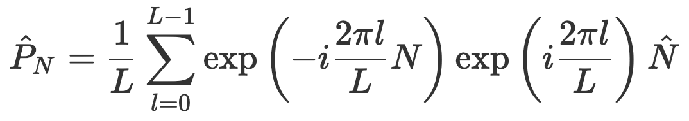

where N is the target number of particles, and we have essentially created a finite (discrete) subgroup to constrain the particle number. Typically based on the precision needed, we can choose L. For us, we used L=10, which was sufficient.

<table>
    <tr>
        <td>
            <table>
                <tr> 
                    <td> <b> Projector? </b></td> 
                    <td> <b> Energy </b></td>
                    <td> <b> Std. Dev. </b></td>
                </tr>
                <tr>
                    <td> No </td>
                    <td> -0.5664</td>
                    <td> 0.0652</td>
                </tr>
                <tr>
                    <td> Yes </td>
                    <td> -0.5017</td>
                    <td> 0.0384</td>
                </tr>
            </table>
        </td>
        <td>
            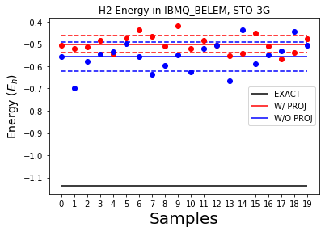
        </td>
    </tr>
</table>

The figure above summarizes our results for the Hydrogen atom. We can see that the projection operator implementation is able to reduce the standard deviation by a factor of ~2. 

*Q: Can the error-mitigation protocol described in Ref. [14] be used for more complicated sym-
metries, like *Ŝ*2?*

It should be possible to find relevant projectors for more complicated symmetries. However, they may be highly non-trivial and are not guaranteed to be Unitary. They may also be very expensive. Please refer to [https://arxiv.org/pdf/1905.08109.pdf] for an extensive review on how to construct operators corresponding to familiar symmetries such as total spin and point group symmetries.

*Q: Suggest an error-mitigation protocol if you know that the right wavefunction should
be an eigenstate of a certain multi-qubit operator *Â* with eigenvalue a.*

If *Â*\|*a*⟩=*a*\|*a*⟩ then the relevant projector *P̂* = \|*a*⟩⟨*a*\|. To finding the second quantized version of this operator we must rely on standard Lie algebra techniques outlined in [https://arxiv.org/pdf/1905.08109.pdf]. Accordingly, the prescription to construct the projector is given by:
<!-- $$
\hat{P} = \frac{1}{2\pi} \int^{2\pi}_0 d\phi e^{i\phi(\hat{A}-a)},
$$ -->

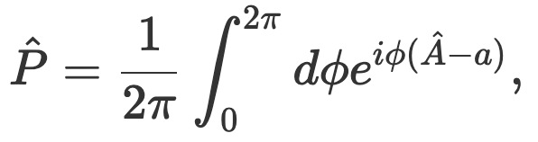

which we may discretize to form a finite subgroup much as we did for the particle number operator in the previous exercise. 

# Optional Challenges

*Q: How to obtain excited electronic states of the same or different symmetry?*

* Different Symmetry

For electronic states of different symmetry we can take two approaches. The first is to construct the projector much as we have done before. As is outlined in [https://arxiv.org/pdf/1905.08109.pdf] one can then handle both commuting and non-commuting symmetry operators via the construction of a Lie Algebra. This projector will allow us to restrict the solution to only subspaces that preserve the symmetry associated with the projector. 
The second (arguably) easier method is to introduce a constraint in the varitional formulation itself:
<!-- 

    \[\begin{aligned}
E[\psi] = \langle\psi|\hat{H}|\psi\rangle + \mu \sum_i (\langle\psi|\hat{O}_i|\psi\rangle - o^{i}_\alpha)^2\end{aligned},\]

 -->

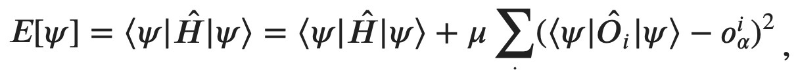

where Ôi is appropriate symmetry operator and oiα is an eigenvalue belonging to the spectrum of possible eigenvalues of Ôi.
The only issue here is that this procedure does not guarantee convergence to a state that possesses the requisite symmetry. In other words, symmetry contamination is possible.

Alternatively, we can recast the minimization problem to the effective Hamiltonian,

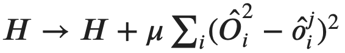

<!-- \(H \rightarrow H + \mu\sum_i(\hat{O}^2_i - \hat{o}^j_i)^2\)  -->
to ensure that the system converges to an eigenstate, since the variance measured via 

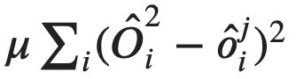

<!-- \(\mu\sum_i(\hat{O}^2_i - \hat{o}^j_i)^2\)  -->
is zero only for eigenstates. This is costly however as we have to calculate Ôi2.
<!-- \(\hat{O}^2_i\) -->

* Same Symmetry

For electronic states in the same symmetry one has to project out the all states with lower energy, but this is generally very difficult as we not only have to find all of the them but we would also have to encode them. The constraint approach is easier and we can just introduce a level shift in the energy spectrum and recast the minimization problem as: 
<!-- \[\begin{aligned}
E[\psi] = (\langle\psi|  \hat{H} |\psi \rangle - E_T)^2\end{aligned}\] -->

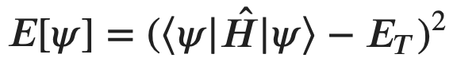
 
This essentially ensures that the solution found is close to the target energy ET, which can be obtained from approximate low cost methods.

 

*Q: What are alternatives to VQE for the eletronic structure problem using quantum computers with shallow circuits without error-correction?*

In our opinion all near-term solutions would be best served using hybrid strategies that leverage the respective strengths of classical and quantum hardware. 

In the immediate future it might be possible to leverage VQE techniques together with quantum machine learning to learn PES. Restricted Boltzmann Machines (RBMs) are already being used to this end. The quantum version might enable more effecient computations and vastly increase the space of solutions, which could then be fine-tuned by classical strategies. 

There has also been a recent proposal to extend imaginary time propagation techniques like quantum Monte Carlo that are run on classical hardware to quantum computers [ https://arxiv.org/pdf/2102.12260.pdf ]. This might be a powerful way to expand on quantum electronic structure calculations. In the near term, solutions from VQE could be used as the initialization state for techniques like DMC. In the future a quantum version of DMC could further leverage quantum hardware.

*Q: Implement H2 calculation on Pennylane

We were told during the Xanadu session to try and implement VQE on Pennylane. It was straightforward to extend their implementation as we just had to change the bond length (please see [S5_Circuits_Pennylane_H2.ipynb]). Unfortunately, it is evident from the figure that the results are wrong since variational energy can never be lower than FCI energies. We did not dig into pennylane to try to identify the source of the problem.

    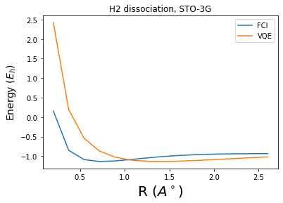

# Business Application
For more details refer to the [Business Application found here](./Business_Application.md)
