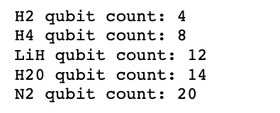

## Project 3: VQE: Constructing potential energy surfaces for small molecules

This project will guide you through the state-of-the-art techniques for solving electronic structure problems on NISQ computers.

Open up [instructions.pdf](https://github.com/CDL-Quantum/CohortProject_2021/tree/main/Week3_VQE/Instructions.pdf) to begin learning about your tasks for this week!

**Please edit this markdown file directly with links to your completed tasks and challenges.**

## Tasks include:
### Part 1: Generating PES using classical methods.
**Analysis:**

### Part 2: Generating the qubit Hamiltonian.
**Analysis:** For a qubit to a valid mapping to a fermion, it must preserve the anti-symmetrical nature of the fermion. In the S2_Hamiltonian_gen.ipynb, we experimented with 5 molecules: H2, H4, LiH, H20 and N2, and were able to generate the qubit hamiltonains, due to the size of each H, we wont list them explicitly in the readme (find them in the notebook), but for reference here are the qubit counts used to simulate them

### Part 3: Unitary transformations.
**Analysis:**

### Part 4: Hamiltonian measurements.
**Analysis:**

### Part 5: Use of quantum hardware.
**Analysis:**

## Further Challenges:
### How to obtain excited electronic states of the same or different symmetry?
**Analysis:**
### Partitioning in the fermionic operator space.
**Analysis:**
### Applying unitary transformations on the Hamiltonian.
**Analysis:**
### Compress larger basis sets into smaller number of qubits.
**Analysis:**

## Business Application

For more details refer to the [Business Application found here](./Business_Application.md)
