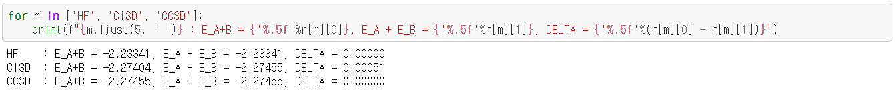
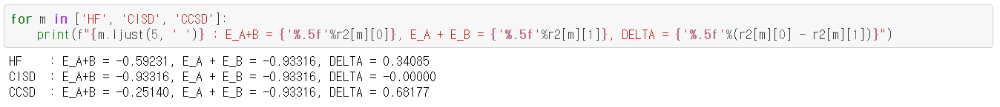
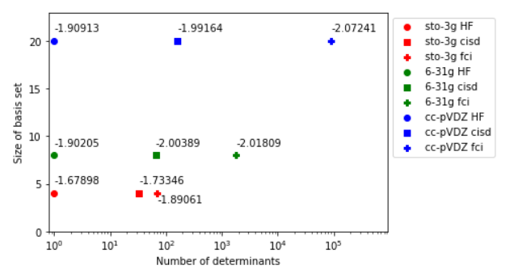
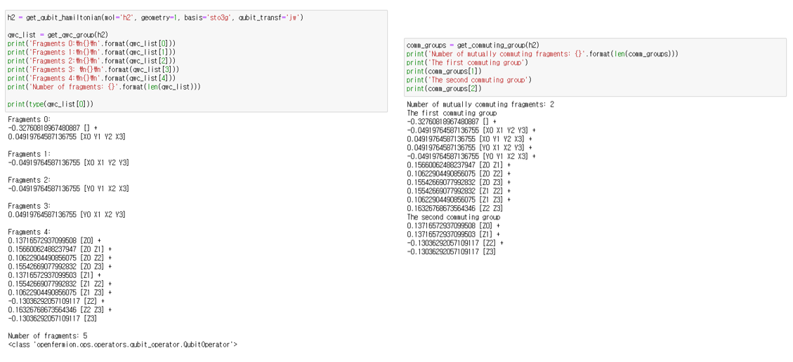

## Project 3: VQE: Constructing potential energy surfaces for small molecules

-----
### _Qunova Computing, Inc._

-----
### Step #1: Generating PES using classical environment

#### Q1) 
Among classical methods, there are techniques based on the variational approach and those that are not. 
Identify variational methods among those that were used and explain advantages of the variational approach. 
Are there any arguments for suing non-variational techniques?

#### Ans) 
* variational approach: Hartree-Fock (HF), Configuration Interaction Singles and Doubles (CISD), Full Configuration Interaction (FCI)
* non-variational approach: Coupled Cluster Singles and Doubles (CCSD)

Let $H$ be a hamiltonian. The variational principle is that
for any normalized wave function $\psi$,

$$ \langle \psi | H | \psi \rangle \ge E_0, $$

where $E_0$ is the ground state energy of $H$.
Because of this principle, it can be said that the variational approach is advantageous.
If we properly choose the function $\psi$, called the trial wavefunction,
we can obtain a quite accurate result via this method.
However, when we deal with larger systems,
CCDS could be a good choice since it is size-extensive,
even though it is a non-variational method.

[Step1](./S1_Classical_Methods.ipynb)

#### Q2) 
_Optional_: There is another division between classical methods, 
it is based on so-called separability or size-consistency. 
Check separability of HF, CISD, and CCSD by taking 2 $\mathrm{H}_{2}$ fragments at a large distance 
from each other and comparing the total energy with 2 energies of one $\mathrm{H}_{2}$ molecule. 
Explain your results. 

#### Ans)
For a large distance (100 Angstrom), we can obtain that $E_{A+B} \approx E_{A}+E_{B}$ as follows:

However, if we take a short distance, we can see the difference between the two values:

Detailed code can be found in [Step1_optional](./S1_Classical_Method_Optional.ipynb).

#### Q3) 
_Optional_: If one is interested in converging to the exact non-relativistic electronic energies, 
there are two independent coordinates: 1) accuracy of accounting for many-body effects beyond the Hartree-Fock method 
(electronic correlation) and 2) accuracy of representation of one-electron states, 
or convergence with respect to the one-electron basis size. 
Convergence along the first coordinate can be illustrated by monitoring reduction of the energy deviations 
from the Full CI answer in a particular basis set for a series of increasingly accurate approaches, 
e.g. HF, CCSD, CCSD(T), CCSDT. 
Convergences along the second coordinate requires the basis set extension 
from STO3G to a series like cc-pVDZ, cc-pVTZ, cc-pVQZ, cc-pV5Z. 
Explore for a small system like $\mathrm{H}_2$ both convergences. 
Which energies should be expected to be closer to experimentally measured ones?

#### Ans) 
In [Step1_optional](./S1_Classical_Method_Optional.ipynb),
we compared the results for HF, CISD, and FCI
on basis sets STO3G, 6-31G, and cc-pVDZ,
and we got the results we theoretically expected:

-----
### Step #2: Generating the qubit Hamiltonian

####Q1) 
What are the requirements for a function of qubit operators 
to be a valid mapping for the fermionic operators?

#### Ans) 
For a fock space $\mathcal{H}_{tgt}\equiv(\mathbb{C}^2)^{\otimes N_f}$ 
and its corresponding fermion operators $\{\hat{a}_{i}\}_{i=1}^{N_f}$, 
a target hamiltonian is simulated as

$$H_{tgt} = \sum_{i,j}{h_{ij}\hat{a}_i^{\dagger}\hat{a}_j} + \sum_{ijkl}{g_{ijkl} \hat{a}_i^{\dagger}\hat{a}_j^{\dagger}\hat{a}_k\hat{a}_l}.$$

Here, the fermion operators obey the following anti-commutation laws:

$$\{\hat{a}_i, \hat{a}_j\} = 0 ~~ \text{and} ~~ \{\hat{a}_i^\dagger, \hat{a}_j\} = \delta_{ij}.$$

Let $\mathcal{H}_{sim}\equiv(\mathbb{C^2})^{\otimes Q}$ be a simulation system with $Q$ qubits.
We describe the transformation $\mathcal{E} : \mathcal{H}_{tgt} \rightarrow \mathcal{H}_{sim}$ 
as an isometry connecting $\mathcal{H}_{tgt}$ and $\mathcal{H}_{sim}$.
That is, any state $\left|\phi\right\rangle$ of the target system is identified with a state
$\mathcal{E}\left|\phi\right\rangle \in \mathcal{H}_{sim}$,
and so $H_{sim}=\mathcal{E} H_{tgt} \mathcal{E}^{\dagger}.$
Therefore, in order for $\mathcal{E}$ to be a valid mapping for the fermionic operators,
the requirements for $\mathcal{E}$ are as follows:

1. It should be unitary equivalent to $H_{sim}$ to preserve the eigenvalues of $H_{tgt}$.
2. (optional) The codespace of $\mathcal{H}_{sim}$ should correspond to the codespace of $\mathcal{H}_{tgt}$
with some constraints, i.e. the number of electrons or spin.

To illustrate this, we gave several examples in [Step2](./S2_Hamiltonian_gen.ipynb).

#### Q2) 
The electronic Hamiltonian is real (due to time-reversal symmetry), 
what consequences does that have on the terms in the qubit Hamiltonian after the Jordan-Wigner transformation?

#### Ans) 
The fermion hamiltonian is given as:

$$ H_{tgt} = \sum_{i,j}{h_{ij}\hat{a}_i^{\dagger}\hat{a}_j} + \sum_{ijkl}{g_{ijkl} \hat{a}_i^{\dagger}\hat{a}_j^{\dagger}\hat{a}_k\hat{a}_l}.$$

Its coefficients are real, and since the hamiltonian is hermitian,

$$h_{ij} = h_{ji} \quad g_{ijkl}=g_{lkji}.$$

So let's rewrite the hamiltonian as:

$$ H_{tgt} = \sum_{i}{h_{ii}\hat{a}^{\dagger}_i\hat{a}_i}+\sum_{i<j}{h_{ij}(\hat{a}_i^{\dagger}\hat{a}_j+\hat{a}_j^{\dagger}\hat{a}_i)}$$
$$+ \sum_{i>l \cup j>k}{g_{ijkl} (\hat{a}_i^{\dagger}\hat{a}_j^{\dagger}\hat{a}_k\hat{a}_l+\hat{a}_l^{\dagger}\hat{a}_k^{\dagger}\hat{a}_j\hat{a}_i})$$
$$+ \sum_{i,j}{g_{ijji} \hat{a}_i^{\dagger}\hat{a}_j^{\dagger}\hat{a}_j\hat{a}_i}. $$

We call the terms in each summation as one-body number operators, one-body excitation operators, two-body excitation operators,
and two-body number operators.

And, it is transformed to a qubit hamiltonian, $H_{sim}$, through the Jordan-Wigner transformation:

$$\begin{cases} \hat{a}_k \rightarrow \hat{Z}_{k{\leftarrow}}\hat{q}_k\\
\hat{a}_k^{\dagger} \rightarrow \hat{Z}_{k{\leftarrow}}\hat{q}_k^{\dagger} \end{cases},$$

where $\hat{Z}_{k\leftarrow}$ means action of the pauli-Z operator on the qubits with indices less than $k$,
and $\hat{q}_k^{(\dagger)}$ is the qubit annihilation (creation) operator on the qubit $k$. So we can check
the codes of two systems are equivalent while the anti commutation law holds.

The simulator hamiltonian becomes a sum of pauli words, shown as below.

1. One-body number operators

    $\hat{a}_i^{\dagger}\hat{a}_i \rightarrow \hat{q}_i^{\dagger}\hat{q}_i=\frac{1}{2}(\hat{I}-\hat{Z}_i)$

2. One-body excitation operators

    $\hat{a}_i^{\dagger}\hat{a}_j + \hat{a}_j^{\dagger}\hat{a}_i \rightarrow \hat{Z}_{(i \sim j)}(\hat{q}_i^{\dagger}\hat{q}_j + \hat{q}_j^{\dagger}\hat{q}_i) $
    $=\frac{1}{2}\hat{Z}_{(i \sim j)}(\hat{X}_i\hat{X}_j+\hat{Y}_i\hat{Y}_j)$

3. Two-body number operators

    $\hat{a}_i^{\dagger}\hat{a}_j^{\dagger}\hat{a}_j\hat{a}_i \rightarrow \frac{1}{4}(\hat{I}-\hat{Z}_i-\hat{Z}_j+\hat{Z}_i\hat{Z}_j)$

4. Two-body excitation operators

    $\hat{a}_i^{\dagger}\hat{a}_j^{\dagger}\hat{a}_k\hat{a}_l+\hat{a}_l^{\dagger}\hat{a}_k^{\dagger}\hat{a}_j\hat{a}_i\rightarrow$

    $  \pm \hat{Z}_{l{\leftarrow}}\hat{Z}_{k{\leftarrow}}\hat{Z}_{j{\leftarrow}}\hat{Z}_{i{\leftarrow}}(\hat{q}_i^{\dagger}\hat{q}_j^{\dagger}\hat{q}_k\hat{q}_l$
    $  + \hat{q}_i\hat{q}_j\hat{q}_k^{\dagger}\hat{q}_l^{\dagger}$)

Therefore, the coefficient of each pauli word in the qubit hamiltonian is real.

#### Q3) 
_Optional_: What are the cons and pros of the Bravyi-Kitaev transformation compared to the Jordan-Wigner transformations?

#### Ans) 
The Bravy-Kitaev transformation is relatively complicated,
so it depends on various factors.
However, if we use the Bravyi-Kitaev transformation,
we can map $N$ fermion operators to qubit operators with weight $O(\log N)$,
whereas the Jordan-Wigner transformation requires weight $O(N)$.

-----
### Step #3: Unitary transformations

-----
### Step #4: Hamiltonian measurements

#### Q1) 
If we focus on a measurement of an expectation value $\langle \Psi | \hat{H}_n | \Psi \rangle$ for a single fragment, $\hat{H}_n$,
since $\left|\Psi\right\rangle$ is not an eigenfunction of $\hat{H}_n$,
we will need to do multiple preparations of $\left|\Psi\right\rangle$ and measurements.
If we denote $\left\{H_{n,k}\right\}$ results of repeated measurements, 
then to obtain the estimate of $\langle \Psi | \hat{H}_n | \Psi \rangle$
we will need to average the obtained results $\bar{H}_{n}=\frac{1}{N}\sum_{k=1}^{N}H_{n,k}$.
Using the central limit theorem, the error of our estimator can be shown to be

\begin{equation}
|\langle \Psi | \hat{H}_n | \Psi \rangle - \bar{H}_{n}| \le \sqrt{\frac{\langle \Psi | \hat{H}_{n}^{2} | \Psi \rangle
- \langle \Psi | \hat{H}_n | \Psi \rangle^{2}}{N}}=\frac{\sqrt{\sigma^{2}_{H_n}}}{\sqrt{N}}.\qquad (1)
\end{equation}
 
The estimator for the expectation value of the entire Hamiltonian $\bar{H}=\sum_{n}\hat{H}_{n}$ can be organized
by adding individual $\bar{H_{n}}$ estimates. Since measurements for different parts are independent 
the following relation holds

$$(\langle \Psi | \hat{H} | \Psi \rangle - \bar{H})^{2} \le \sum_{n}\frac{\sigma{2}_{H_n}}{N_n}, \qquad (2)$$

where $N_n$ is the number of measurements for each fragment. The question arises how to split the
entire number of measurements one can afford to do, $N_{T}=\sum_{n}N_{n}$,
between each fragment so that the total error is the lowest? Show that if one knows fragment variances $(\sigma_{H_n}^{2})$
the optimal splitting gives the error

$$|\langle \Psi | \hat{H} | \Psi \rangle - \bar{H}| \le \frac{\sum_{n}\sqrt{\sigma^{2}_{H_n}}}{\sqrt{N_{T}}}. \qquad (3)$$

How many measurements should one do per fragment, $N_n$, in this optimal splitting?

#### Ans) 
Let 

$$f(N_{1}, N_{2}, \cdots, N_{n})=\sum_{n}\frac{\sigma^{2}_{H_n}}{N_n}$$

and

$$g(N_{1}, N_{2}, \cdots, N_{n})=\sum_{n}N_{n}.$$

By applying the Lagrange multiplier method,
that is, solving equations $\nabla f=\lambda \nabla g$ and $g=N_{T}$,
it can be shown that $f$ has the minimum value 

$$\frac{\sum_{n}\sqrt{\sigma^{2}_{H_n}}}{\sqrt{N_{T}}}$$

when 

$$N_{i}=\frac{N_{T}\sqrt{\sigma^{2}_{H_i}}}{\sum_{n}\sqrt{\sigma^{2}_{H_n}}}.$$

#### Q2)
Using Eq. (3) calculate how many measurements $N_{T}$ is needed to achieve 1 mili
Hartree estimator error for the qubit-wise commuting (QWC) and fully commuting (FC)
partitionings in one of the model systems.

#### Ans)
We here consider $\mathrm{H}_2$.
Using the given code, we can get fragments for the QWC and FC as shown below.

(i) QWC

We use the state $\left|\Psi_{H_{2}}\right\rangle=\left|1100\right\rangle$.
It follows from simple calculations that
$\sigma_{H_{0}}^{2}=\alpha_{0}^{2}$, $\sigma_{H_{1}}^{2}=\alpha_{1}^{2}$,
$\sigma_{H_{2}}^{2}=\alpha_{2}^{2}$, $\sigma_{H_{3}}^{2}=\alpha_{3}^{2}$
and $\sigma_{H_{4}}^{2}=0$,
where $\alpha_{0}$, $\alpha_{1}$, $\alpha_{2}$, and $\alpha_{3}$
are the coefficients of $XYYX$, $XXYY$, $YYXX$, and $YXXY$, respectively.
Hence, from Eq. (3), we can say that
$|\langle \Psi | \hat{H} | \Psi \rangle - \bar{H}|$
is upper bounded by $\frac{1968}{10000\sqrt{N_{T}}}$
Therefore, if we want to achieve 1 mili Hartree estimator error,
we need to take $N_{T}>38730$.

(ii) FC

For FC, we have $\sigma_{H_{0}}^{2}=(\alpha_{0}-\alpha_{1}-\alpha_{2}+\alpha_{3})^{2}$
and $\sigma_{H_{1}}^{2}=0$.
Therefore, $\frac{1968}{10000\sqrt{N_{T}}}$
is also upper bound of $|\langle \Psi | \hat{H} | \Psi \rangle - \bar{H}|$,
and so we need to take $N_{T}>38730$ to achieve 1 mili Hartree estimator error.

#### Q3)
_Optional_: Assuming that we could measure the entire $\hat{H}$ as a single operator, estimate using Eq. (1)
(use $\hat{H}$ instead of $\hat{H}_n$) how many measurements would be needed to reach 1 mili Hartree
estimator error for the same systems as in the previous question?

#### Ans)
In this case, we can see that $\sigma_{H}^{2}=(\alpha_{0}-\alpha_{1}-\alpha_{2}+\alpha_{3})^{2}$.
Hence, it has the same result as Q2.

## Further Challenges:
* How to obtain excited electronic states of the same or different symmetry?
* Partitioning in the fermionic operator space.
* Applying unitary transformations on the Hamiltonian.
* Compress larger basis sets into smaller number of qubits.

## Business Application
For each week, your team is asked to complete a Business Application. Questions you will be asked are:

* Explain to a layperson the technical problem you solved in this exercise.
* Explain or provide examples of the types of real-world problems this solution can solve.
* Identify at least one potential customer for this solution - ie: a business who has this problem and would consider paying to have this problem solved.
* Prepare a 90 second video explaining the value proposition of your innovation to this potential customer in non-technical language.

For more details refer to the [Business Application found here](./Business_Application.md)
