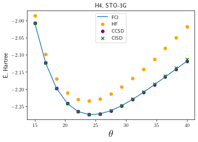
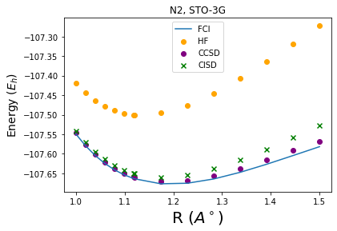
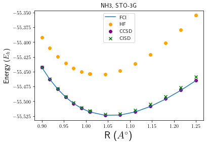

## Project 3: VQE: Constructing potential energy surfaces for small molecules

# Task 1: Generating PES

The first task we were assigned with was to run PES calculations for $H_2$ and $H_2O$ molecules using popular quantum chemistry methods such Hartree-Fock (HF), Configuration Interaction Singles and Doubles (CISD), Coupled Cluster Singles and Doubles (CCSD), and Full Configuration Interaction (FCI), in the minimal STO-3G basis.
Subsequently we were asked to compute similar curves for other molecules $H_4$, $LiH$, $N_2$, and $NH_3$. 

<table>
        <tr>
            <td></td>
            <td></td>
        </tr>
        <tr>
            <td></td>
            <td></td>
        </tr>
        <tr>
            <td></td>
            <td></td>
        </tr>
</table>

*Q: Among classical methods, there are techniques based on the variational approach and those
that are not. Identify variational methods among those that were used and explain advantages of
the variational approach. Are there any arguments for using non-variational techniques?*

<table>
    <tr>
        <td> <b>Method</b> </td>
        <td> <b>Type</b> </td>
    </tr>
    <tr>
        <td> HF </td>
        <td> Variational </td>
    </tr>
    <tr>
        <td> CISD </td>
        <td> Variational </td>
    </tr>
    <tr>
        <td> CCSD </td>
        <td> Not Variational </td>
    </tr>
    <tr>
        <td> FCI </td>
        <td> Exact </td>
    </tr>
</table>

One of the main advantages of a variational method is that is that the energy obtained from such a method is guaranteed to be bounded from below by the exact energy. Provided we are not very far away from the exact energy, we may thus get a sense of the quality of the ansatz that can be systematically improved. 

Non-variational techniques like CCSD can still be very powerful to study systems as they might be cheaper than their variational counterparts. This enables us to access larger number of orbitals which might be essential to capture properties of the system of interest. In some instances, like CCSD, they can be also be systematically improved by incorporating highter order excitations directly (for. e.g. CCSDT, CCSDTQ) or indirectly/perturbatively (e.g. CCSD(T)). It is worth noting that despite not being variational, Coupled Cluster methods have been very accurate and is considered the "gold standard" for computational chemistry. 

*Q: Optional: There is another division between classical methods, it is based on so-called sep-
arability or size-consistency. Simply speaking, if one investigates two molecular fragments (A and
B) at a large distance from each other (∼ 100 Å) then the total electronic energy should be equal
to the sum E A+B = E A + E B , where the energy of each fragment (E A or E B ) can be obtained in a
calculation that does not involve the other fragment. If this condition is satisfied for a particular
method, this method is separable or size-consistent. Check separability of HF, CISD, and CCSD
by taking 2 H 2 fragments at a large distance from each other and comparing the total energy with
2 energies of one H 2 molecule. Explain your results.*

<table>
    <tr>
        <td>
            <table>
                <tr>
                    <td> <b>Method</b> </td>
                    <td> <b>Type</b> </td>        
                </tr>
                <tr>
                    <td> HF </td>
                    <td> Size-consistent </td>
                </tr>
                <tr>
                    <td> CISD </td>
                    <td> Not size-consistent </td>
                </tr>
                <tr>
                    <td> CCSD </td>
                    <td> Size-consistent </td>
                </tr>
            </table>
        </td>
        <td>
            
        </td>
    </tr>    
</table>

Both CCSD and HF are size-consistent whereas CISD is not. This is due to the truncation of the excitations in CISD to only doubles. To elaborate: since we are allowing double excitations of the ($H_2$) monomers this means that when we put two monomers together there is the possibility of two simultaneous double excitations (for an effective quadrapule excitation). However, since CISD restricts excitations only to doubles we are removing that possibility. As a result the energy of the 2 monomers together is always larger than double the energy of one monomer. HF doesn't have this problem since it is an effective single particle theory and energies are additive. CISD fully accounts for all possible excitations in the constituent electrons at the doubles level (allowing for simultaneous excitations) and, thus, doesn't have size-consisteny issues.

*Q: Optional: If one is interested in converging to the exact non-relativistic electronic energies,
there are two independent coordinates: 1) accuracy of accounting for many-body effects beyond
the Hartree-Fock method (electronic correlation) and 2) accuracy of representation of one-electron
states, or convergence with respect to the one-electron basis size. Convergence along the first
coordinate can be illustrated by monitoring reduction of the energy deviations from the Full CI
answer in a particular basis set for a series of increasingly accurate approaches, e.g. HF, CCSD,
CCSD(T), CCSDT. Convergences along the second coordinate requires the basis set extension from
STO3G to a series like cc-pVDZ, cc-pVTZ, cc-pVQZ, cc-pV5Z. Explore for a small system like H 2
both convergences. Which energies should be expected to be closer to experimentally measured
ones?*

<table>
    <tr>
        <td>
            
        </td>
        <td>
            
        </td>
    </tr>
</table>

The standard quantum chemistry canon is shown in the figure above (left). So we should expect to see that same as we monitor $H_2$. In paricular in the large basis and higher electron correlation energy accounting limit we should obtain answers that are in agreement with experiment. Our intuition is corraborated by the figure (right) and we see that as we increase our ability to capture electron correlation and size of the basis, we approach experimental values. Note with CCPV5Z and experiment is $|\Delta E| = 0.45$ $mE_h$ 

# Task 2: Generating Qubit Hamiltonian

# Task 3: Unitary Transformations

# Task 4: Hamiltonian Measurements

# Task 5: Use of Quantum Hardware

For more details refer to the [Business Application found here](./Business_Application.md)
