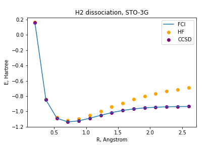

# Questions 

## Step #1: Generating PES using classical methods
1. Among classical methods, there are techniques based on the variational approach and thosethat are not.  Identify variational methods among those that were used and explain advantages ofthe variational approach.  Are there any arguments for using non-variational techniques?

|        |                 | 
|:------:|:---------------:|
|   HF   |   Variational   |
|  CCSD  | NOT Variational | 
|  CISD  |   Variational   | 
|   FCI  |   Variational   |

Are there any arguments for using non-variational techniques?

Yes, to improve accuracy and in addition, non-variational techniques can ensure size consistency which is not ensured by truncated CISD (see response 2.).

The scalability of post-Hartree Fock (HF) methods, such as CISD and FCI, is the main bottleneck to simulate larger molecules with high accuracy. 
A non-variational method that can improve the accuracy without increasing substantially the computational cost is Coupled Clusters Single Doubles (CCSD), which is a truncated version of Coupled Cluster (CC) theory. In the CC theory, the improvement of the wave function is through the application of the exponential of cluster operators  to the HF wave function,  .
It has been claimed that the exponetial  makes the CC methodology a good fit for quantum computing (ref?).

<!---
Coupled cluster (CC) theory provides a compelling framework of approximate infinite-order perturbation theory, in the form of an exponential of cluster operators describing the true quantum many-body effects of the electronic wave function at a computational cost that, despite being significantly more expensive than DFT, scales polynomially with system size. 
-->

Bellow we present the pontential energy surfaces (PESs) for the dissociation of H2, LiH, H2O and H4 molecules using different methods.
|  |  | 
| :---------: | :---------: |
|   |  |
|  |  |

2. There is another division between classical methods, it is based on so-called separability or size-consistency.   Simply speaking, if one investigates two molecular fragments (A and B) at a large distance from each other (∼100 ̊A) then the total electronic energy should be equalto the , where the energy of each fragment ( or ) can be obtained in a calculation that does not involve the other fragment.  If this condition is satisfied for a particular method, this method is separable or size-consistent.  Check separability of HF, CISD, and CCSD by taking 2  fragments at a large distance from each other and comparing the total energy with 2 energies of one  molecule.  Explain your results.

|        | Energy   | Energy   | Energy        |
|--------|----------|----------|---------------|
| Method |  H2 [Ha] | H4 [Ha]  | H4 -2 * H2 [Ha] |
|   UHF  | -1.06610 | -1.19557 | 0.93665       |
|  RHF   | -1.06610 | -2.13222 | 2.12E-12      |
|  CCSD  |  -1.1012 | -2.2023  | 1.568E-12     |
|  CISD  | -1.1012  | -2.2003  | 0.00203       |
|   FCI  |  -1.1012 | -2.2023  | 1.59E-12      |

For an infinitely stretched molecule we expect the energy to be the sum of the energies of the individual fragments. In the limit of infinite internuclear separation, the energy of H4 should equal twice the energy of the H2 molecule. Any discrepancy between these two energies would imply that the method is not size consistent. 
HF can only represent one electronic configuration, which for the H2 molecule is a singlet, however, in the limit of infinitevely separated atoms, each Hydrogen atom's electron has a multiplicity of a triple (I don't understand this Rodrigo). This is the primary source of error for HF, the inability to describe systems with multiple electronic configurations.
On the other hand, CCSD, CISD and FCI, do account for multiple electronic configurations in the wave function.
We computed the energies for a planar H4 molecule when the separation between the two H2 fragments is as large as 100A (see table). The calculations were performed for a planar H4 molecule dissociating into 2 H2 molecules with separation corresponding to the minimum energy (see figure for dissociation curve H2 above)(is that the case for your calcs Rodrigo?).  The first 3 columns correspond to energies computed using the program ... and the last 3 to energies computed with tequila.
We observe that CCSD is size consistent but CISD isn't. That is also what is claimed in the literature (add ref joh).
On the other hand we see that FCI is size consistent and HF as well as long as we use the restricted version of HF (Rodrigo can ypu comment on UHF/RHF?).

3. Optional:  If one is interested in converging to the exact non-relativistic electronic energies, there  are  two  independent  coordinates:  
  1. accuracy  of  accounting  for  many-body  effects  beyondthe Hartree-Fock method (electronic correlation)
  2. accuracy of representation of one-electronstates,  or  convergence  with  respect  to  the  one-electron  basis  size.   
Convergence  along  the  firstcoordinate  can  be  illustrated  by  monitoring  reduction  of  the  energy  deviations  from  the  Full  CI answer in a particular basis set for a series of increasingly accurate approaches, e.g.  HF, CCSD,CCSD(T), CCSDT. Convergences along the second coordinate requires the basis set extension from STO3G to a series like cc-pVDZ, cc-pVTZ, cc-pVQZ, cc-pV5Z. Explore for a small system like H2 both  convergences.   
Which  energies  should  be  expected  to  be  closer  to  experimentally  measure dones?

