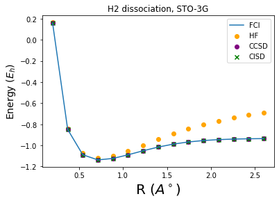
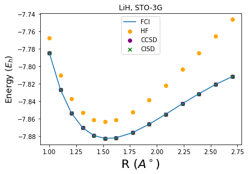

## Project 3: VQE: Constructing potential energy surfaces for small molecules

# Task 1: Generating PES

The first task we were assigned with was to run PES calculations for $H_2$ and $H_2O$ molecules using popular quantum chemistry methods such Hartree-Fock (HF), Configuration Interaction Singles and Doubles (CISD), Coupled Cluster Singles and Doubles (CCSD), and Full Configuration Interaction (FCI), in the minimal STO-3G basis.
Subsequently we were asked to compute similar curves for other molecules $H_4$, $LiH$, $N_2$, and $NH_3$. 

<table>
        <tr>
            <td></td>
            <td></td>
        </tr>
        <tr>
            <td></td>
            <td></td>
        </tr>
        <tr>
            <td></td>
            <td></td>
        </tr>
</table>

# Task 2: Generating Qubit Hamiltonian

# Task 3: Unitary Transformations

# Task 4: Hamiltonian Measurements

# Task 5: Use of Quantum Hardware

For more details refer to the [Business Application found here](./Business_Application.md)
