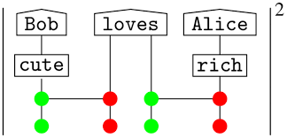
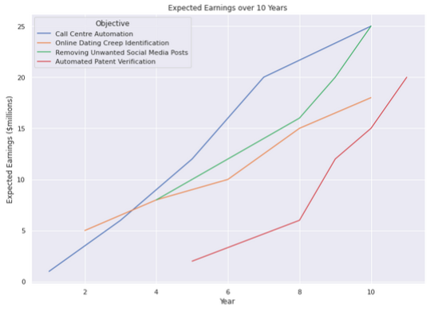

# Business Application: Quantum Natural Language Processing (QNLP)

.

## Introduction to Qlinguo

#### Qlinguo is a software service that translates human language into machine language.

In science fiction, computers will sometimes say "does not compute" when faced with human emotions.
Qlinguo is a platform that *will* compute. Specifically, our platform will translate *human* language,
with all its double entendres, sarcasm, and jargon, into *computer* language.
As of now, we have produced an early technical demonstration of how our technology would enable this feat.
Our work can be found at [Technical ReadMe](README.md).

#### See our presentation [here](https://drive.google.com/file/d/18cDZyMOz2K5DMXj6QvFpHl18n7QQZbOi/view?usp=sharing).

## Business Strategy

Our software service will automate business activities that require human language processing.
Our strategy is to begin with easier, better established use cases of such technology in order to demonstrate the superiority of our technology. Our focus at this early stage will be on improving technical support outcomes by automating client interaction. This is a competitive space but our "secret sauce", quantum technology, will give us a powerful edge.

Having established the competitive edge of our technology, we will progress to a problem that is currently intractable with current technology. This is the problem of identifying undesirables on social media. Our approach at this stage will be to progress from simpler versions of the problem (identifying "creeps" on dating websites) through to the more advanced forms (identifying "toxic content" on social media platforms like Twitter).

Finally, we will tackle the most challenging problem that we believe has the highest payoff. This is the problem of legal compliance in large organisations. Currently, these large organisations need expensive teams of in-house legal counsel; most notably, to check for patent infringement. This is particularly difficult problem because legal text contains a great deal of bespoke jargon whose interpretation is precisely what is being debated. Furthermore, patents are often deliberately vague and so many possible interpretations must be considered. By automating even part of this process, we expect to significantly reduce legal costs for large organisations; especially those such as Samsung and Apple that have large and complex patent portfolios that are used in IP warfare.

The triggers for these transitions are a combination of technological and commercial outcomes. We at each stage we validate our technology by demonstrating market viability. Dominance is desirable but not necessary. In the meantime, the revenue from these business activities will support the further development of the underlying technology in order to get ahead of current technological platforms. We are running a marathon, not sprinting.

.

## Technical Feasibility

From a technical standpoint, the problem we are solving is that of *sentiment analysis* in human speech and text. Sentiment analysis is the process of inferring what humans are *thinking* based on what humans are *saying*. Significant research and development resources are being directed at improving these outcomes. Qlinguo relies on quantum methods of natural language processing, as we explain below.

Quantum Natural Language Processing (QNLP) is an approach to semantic analysis which uses emerging quantum technology to process human language more accurately than any established technology. Current approaches to Natural Language Processing (NLP) are dominated by the so-called “bag of words” approach: where first a set of several thousand context words gets identified. From there, researchers use a corpus to determine how often other words appear near these context words (for example, next to “sports,” you’ll likely see mentions of “football,” “baseball,” “hockey,” and other closely related words). All these words come together to create the word vector for any particular word (in this case, the term “sports”).

This approach is typically referred to as a distributional approach to NLP and uses the vector space model to determine the meaning of words. A second approach to NLP called compositional model (also known as semantics), boils grammatical structures down to mathematical algorithms – essentially turning sentences into networks of words where these words interact to create meaning. Our approach combined the two previous approaches into something called the [“compositional distributional model”](https://arxiv.org/abs/1003.4394) implemented in a quantum computer. In our approach a direct correspondence is established on the one hand between the meanings of words and quantum states, and on the other hand grammatical structures and quantum measurements. This is done by encoding sentence networks into something a quantum circuit can understand.

Qlinguo specializes in finding sentiment to text using quantum technology.
Qlinguo gives meaning to unstructured data. We enable our clients to quickly extract value and insights from large amounts of information. Internal documents, emails, instant messages, support tickets, news, and other textual data contain valuable information affecting your business. However, most of this text is unused because it is unstructured and hard to process. Using proprietary Quantum Natural Language Processing (QNLP) technology, we are able to model the problem of classifying text by taking into account the grammatical structure or composition of text, where these interact to create meaning. Qlinguo solves this problem and helps users to extract valuable insights quickly and easily by transforming their unstructured text into structured data..

In a recent paper [6] a proof-of-concept has been published where text classification an important component of NLP and QNLP are compared. A hybrid quantum-classical model is used to solve a text classification problem on the IMDB Movie Sentiment Dataset, using 4 different types of embeddings. Using precalculated embedings along with dense neural network layers and a variational quantum circuit, the hybrid model clasifies text using Pennylan and TFHub, the results are good, taking into account the early stages of quantum hardware, and the potential of the use case for further developments of similar type.

|Model embeddings|Accuracy classical model| Accuracy Hybrid classical-quantum model|
|----|----|----|
| Swivel| 87.5| 86.7 |
|NNLM-50| 99.8| 99.6|
| NNLM-128|99.7| 99.8|
| USE | 84.0 | 88.0|

As you can see in the table the hybrid quantum-classical model accuracy is close to the classical NLP model accuracy for the different embedings and in the USE case, QNLP surpases its classical analog. These are encouraging results.

## NLP Industry Overview
The Global NLP Market was valued at USD 10.72 billion in 2020, and it is expected to be worth USD 48.46 billion by 2026, registering a compound annual growth rate (CAGR) of 26.84% during th forecast period (2021-2026). Due to the ongoing Covid-19 pandemic the market is witnessing growth in healthcare sector.
The natural language processing market includes hardware (processor, GPU, etc.), software (tools provided by major vendors to support NLP-based features), and services (API-based SaaS offering). Other key segments include segmentation by processing type (image, text, and speech/voice-based), the market is also segmented by the size of organization (large organizations and small and medium organizations), by end-user industry (education, BFSI, healthcare, IT and telecom, retail, etc.) and by geography (North America, Europe, Asia-Pacific, and Rest of the World).
Large organizations are increasingly adopting deep learning, along with supervised and unsupervised machine learning technologies for various applications, the adoption of NLP is likely to increase. Cost and risk are some of the major factors driving the adoption of these technologies among large organizations. Most of the large end-user organizations across various industries are mainly utilizing these technologies to enhance their internal and external operations.
large-scale social media platforms are also utilizing text analytics and NLP technologies for monitoring and tracking social media activities, such as political reviews and hate speeches. Platforms like Facebook and twitter are managing the published content with the help of these tools.
------ ADD THE IMAGE SENT SEPARATELY

### Analysis of Competition

**Major players:**

|Company name|Profit 2020|
|----|----|
| Microsoft Corporation| $96.937B|
|Micro Focus International PLC.| $3 Billion|
| SAS Institute Inc.|$3 Billion|
| IBM Corporation.| $35.574B |
|Google Inc (Alphabet Inc.|$182.527B |

**Competitors for automation via chatbots (call center vertical):**

|Company name|Country| Founded|Capital raised|
|----|----|----|----|
| Nuance|USA|1992| $+25M|
|Next IT|USA|2002| $+15M|
|Mind Meld|USA |2011|$+25M|
|PypeStream|USA|2009|$+22.5M |

### Target Early Adopters
|Company name example|Sub-segment|Segment|
|----|----|----|
| CDC, ECDC|Covid-19 related organizations|Healthcare|
|Vodafone,ATT|Telecoms|IT & telecom|
|BOA, Scotiabank, Federal Reserve Banks|Banks & Insurance|Finance|
|Seven eleven, Walmart| Supermarkets|Retail|
|R&D computer science schools|Schools, Colleges, Universities|Education|
|Reuters, Bloomberg|Financial data|Financial services|
|BetUS, Aleph Holding |Multiple types|Other End User Industries|

## References
[1] [Coecke, B. et al. Quantum Natural Language Processing](http://www.cs.ox.ac.uk/people/bob.coecke/QNLP-ACT.pdf)

[2] [Quantum Natural Language Processing Medium](https://medium.com/cambridge-quantum-computing/quantum-natural-language-processing-748d6f27b31d).

[3] [Applications of NLP | 5 Vital Applications of Natural Processing Language](https://www.educba.com/applications-of-nlp/).

[4 [Machine Translation Market](https://www.mordorintelligence.com/industry-reports/machine-translation-market).

[5] [Global Chatbot Market](https://www.marketdataforecast.com/market-reports/chatbot-market).

[6] Baronia, Dhruv (2021): Hybrid Quantum-Classical Neural Networks for Text Classification. TechRxiv. Preprint. https://doi.org/10.36227/techrxiv.13488420.v1
