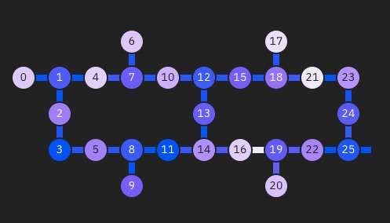

# Functorial Learning Business Application

Quantum algorithms are compiled into quantum circuits that implement the logical operations of the algorithm.  The current 
generation of quantum computers can support only shallow circuits -- those consisting of only tens of qubits and a limited number 
of logical operations before degradation of the quantum data and program failure.    Reducing  the size of quantum circuits that solve  
meaningful problems is therefore  critical for realizing the power of  near-term power of quantum computers.  

Some quantum technologies, notably superconducting qubit devices, support only nearest-neighbor interactions between qubits. For 
example, IBM's backend "kolkata" supports interactions according to the following figure. 

Mapping an 
ideal quantum circuit to a device supporting nearest-neighbor interactions (known as transpiling) greatly increases the depth of the c

Here we introduce WTF -- a method for predicting the cost of transpiling an ideal quantum circuit to a 

A brief example for each question is included for the 
[Traveling Salesman Problem.](https://en.wikipedia.org/wiki/Travelling_salesman_problem)

## Step 1: Explain the technical problem you solved in this exercise

Example: Finding a global minimum in settings where a classical approach may not be able to find a global minimum.

## Step 2: Explain or provide examples of the types of real-world problems this solution can solve

Example: A courier has to deliver parcels to several locations and is looking to minimize its travel time. (e.g., “the travelling salesman problem”).

## Step 3: Identify at least one potential customer for this solution - ie: a business who has this problem and would consider paying to have this problem solved

Examples: 
- Federal Express
- Canada Post

## Step 4: Prepare a 90 second video explaining the value proposition of your innovation to this potential customer in non-technical language

Example: By travelling to all destinations via the shortest route, a courier can generate the same revenue that it would have generated following any other route, but will minimize travel costs (e.g., fuel costs). By minimizing travel costs, the courier will be more profitable than it would have been had it travelled through any other route.

**Please store your video externally to the repo, and provide a link e.g. to Google Drive**
