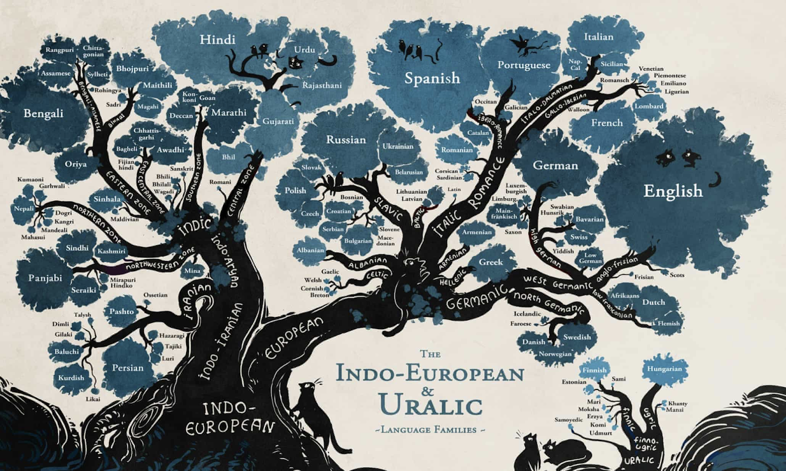
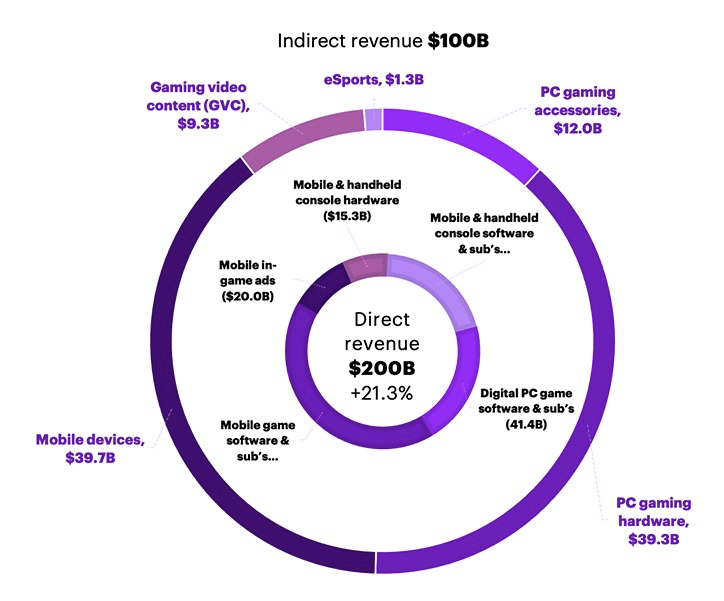

# XBroca: Quantum Cohort Project Business Application

## Introduction to XBroca

Word embedding is probably one of the most beautiful and romantic ideas in the history of artificial intelligent (AI). Natural Language Processing (NLP) is a form of AI that focuses on analyzing the human language to draw insights, create advertisements and many more. Natural language processing (NLP) is another compute-heavy technology in which AI/ML is being used to improve user experience. In XBroca we try to elevate the capability of NLP in order to have human-like conversation between human and machines. XBroca is expert in exploiting Quantum NLP (QNLP) in order to build a conversation agent that can form new factual content into conversations as naturally as humans. This breakthrough technology has tremendous applications across several industries, however for the purpose of this project, we only focus on Video Gaming industry.

## NLP Timeline

History has proven time and time again that we are willing to change everything in our environment to our wishes and desires. Speech is the most effective way of communication and it’s only normal that we want our inventions to understand it (https://medium.datadriveninvestor.com/the-brief-history-of-nlp-c90f331b6ad7). The study of NLP generally started in the 1950s. Alan Turing published and article titled “Computing Machinery and Intelligent” in 1950 which proposed what is called the Turing test as a criterion of intelligence (https://medium.datadriveninvestor.com/the-brief-history-of-nlp-c90f331b6ad7). In 1960 the first chatbot was developed in MIT. It answered some very simple decision tree questions (https://www.information-age.com/history-of-the-chatbot-123479024/).

Furthermore, up to the 1980s, most NLP systems were based on complex sets of hand-written rules. Starting in the late 1980s, however, there was a revolution in NLP with the introduction of machine learning(ML) algorithms for language processing. (https://medium.datadriveninvestor.com/the-brief-history-of-nlp-c90f331b6ad7).

Watson was a project developed from 2004 to 2011 by IBM to beat the best humans at the television game show Jeopardy! (https://medium.com/@giacaglia/how-ibm-watson-works-40d8d5185ac8)

While the grand challenge driving the project was to win on Jeopardy! The broader goal of Watson was to create a new generation of technology that can find answers in unstructured data more effectively than standard search technology. 
(https://www.ibm.com/ibm/history/ibm100/us/en/icons/watson/)

Before deep learning became the go-to solution for most of the machine learning problems, Watson represented the peak of the use of probabilistic reasoning. Currently, much natural language processing research has relied heavily on ML and also relying even more on ML because of the big breakthrough the now-famous subfield of ML called Deep Learning(DL) (https://medium.datadriveninvestor.com/the-brief-history-of-nlp-c90f331b6ad7).

NLP is the AI technique underlying chatbots that trigger interactions with humans in natural language. (Gaming Chatbots for Next-Level In-Game Experience (oodles.io). AI uses machine learning algorithm to inherent human reasoning and logic required to play the game efficiently. The earliest recorded use of AI in video games dates back to 1987 when AI mainly responded to certain actions encoded into the games as well as some random moves. Currently, the kind of self-learning AI which is deep learning subset of the broader machine learning revolution has led to advances in self-driving cars, computer vision and NLP hasn’t really blend over into commercial game development. Advance gaming technologies such as virtual reality and augmented reality are augmenting the demand for AI chatbots more than ever (Gaming Chatbots for Next-Level In-Game Experience (oodles.io).

## Business Pitch

One of the critical challenges for gaming companies is to attract and retain users. AI offers unique retention and player acquisition solutions to these companies. It provides immersive experiences to engage gamers. In order to engage more gamers, video gaming industry is pushing businesses away from being product-centric to becoming experience-oriented platforms. (https://newsroom.accenture.com/news/global-gaming-industry-value-now-exceeds-300-billion-new-accenture-report-finds.htm). That’s why digital customer experience is vital to a game's popularity. To address the above challenge, XBroca helps companies to enhance their customers’ experiences and their online interactions by providing human-like interactions between players and machines. We are revolutionizing the gaming industry with captivating gaming experience that can’t be achieved on any other platform. In XBroca the ultimate goal is to enhance player real-time interactions with animated game characters to initiate human-like conversation between players and machines. 

Our technology adds three new features to your video games: 

1. Enhance player interactions with animated actors (Humanlike interaction)
2. Recognize voice commands
3. Improve customer support

## Video Gaming Industry Overview

Video gaming is one of the most popular hobbies cited by people around the globe. The video gaming industry reached $180 billion in 2020 with the growth rate of 20%. (https://www.forbes.com/sites/forbesbusinesscouncil/2021/03/16/why-the-gaming-industry-could-be-the-new-social-media/?sh=700ccf738f3a). In a new study conducted by Accenture, it is estimated that the full value of the gaming industry now exceeds $ 300 billion. (https://newsroom.accenture.com/news/global-gaming-industry-value-now-exceeds-300-billion-new-accenture-report-finds.htm). 

There are plenty of people who play video games as hobby, there are may who play professionally. In fact, with the development of video game platforms, people can also connect with each other in a way they have never been able to before. The gaming industry has increased by half a billion players in the past three years, totaling 2.7 billion people globally. For instance, Twitch has 15 million daily users and Discord sees over 140 million monthly users. The market research predicts more than 400 million new gamers are expected by the end of 2023. (https://newsroom.accenture.com/news/global-gaming-industry-value-now-exceeds-300-billion-new-accenture-report-finds.htm)

In response to this demand, Google and Microsoft announced their own cloud gaming services. This means that players can stream games as easily as streaming a movie. (https://www.loginradius.com/blog/fuel/improving-customer-experience-in-the-gaming-industry/). Amazon has already mentioned its interest in developing an Amazon Games feature as a way to be part of this ever-expanding gaming industry, adding to its acquisition of Twitch several years ago. (https://www.forbes.com/sites/forbesbusinesscouncil/2021/03/16/why-the-gaming-industry-could-be-the-new-social-media/?sh=700ccf738f3a). 

## Competitors
The NLP market is getting increasingly competitive. Here there are top players according to the recent studies. 
|Company name|Country|R&D budget|Revenue|
|- | - | - | - |
|IBM Watson|NA|$ 73.6 billion|
|Folio3|USA|---|$ 55.5 million|$ 1.6 billion|
|SoundHound|USA|NA|$ 51.5 million|
|Gracenote|USA|NA|$ 98.76 million|
|Mobvoi|China|NA|$ 80 million|
|Open AI|NA|$ 27.4 million|
|DeepMind|NA|$ 266 million|

## Customers

This top video game companies ranking is based on analysis of annual and quarterly financial report published by a number of relevant publicly listed game companies. 

|Company name|Country|R&D budget|Revenue|
| - | - | -| - |
|Tencent|China|$ 6.029 billion*|$ 74 billion|
|Sony|Japan|$ 1.32 billion|$ 81.7 billion|
|Apple|USA|$ 18.75 billion**|$ 79.5 billion**|
|Microsoft|USA|$ 20.70 billion*|$ 5.0 billion***|
|NVIDIA|USA|----|$ 10.92 billion|
|Epic Games|USA|NA|$ 5.1 billion|

## Geographic market segmentation

Video gaming industry is selling products that are subject to difference in regional culture, language and so on. Therefore, it is useful to look at geographic market segmentation to target products to people who live or shop in a specific location. According to the recent market research, China, Japan, United kingdom and the United States are the four largest gaming markets. These markets represent 47% of all gamers globally and 64% of all direct consumer spend on gaming. 

|Global Rank|Country|Revenue|% Global Revenue|% of gamers|
| - | - | - | - | - | 
|1|China|$ 51 billion| 26%|35%|
|2|United State|$ 48 billion|24%|8%|
|3|Japan|$ 24 billion| 12%|3%|
|4|United Kingdom|$ 7 billion|3%|1%|

Source: https://www.accenture.com/us-en/insights/software-platforms/gaming-the-next-super-platform?c=acn_glb_thenewgamingexpbusinesswire_12160747&n=mrl_0421

## Market drivers

Widespread adoption of smartphones globally is bringing in new players to the gaming world. And mobile will continue to enable new opportunities within gaming that simply didn’t exist even just a few years ago. But rather than cannibalizing existing markets for console and PC gaming, the industry has adapted by increasingly emphasizing gaming’s social dimension. As this happens, we’re seeing new levels of engagement, with different groups turning to online competition. In order to realize its full potential, the gaming industry must balance the needs of its newest adopters – and the 400 million new gamers expected within the next few years – with the expectations of historical gaming loyalists, many of whom are still the industry’s most lucrative customers. (https://www.accenture.com/us-en/insights/software-platforms/gaming-the-next-super-platform?c=acn_glb_thenewgamingexpbusinesswire_12160747&n=mrl_0421)

For each weekly project, your team is asked to complete the below business application exercise.
To complement the technical tasks, please consdier the four questions below.
You are free to format your response to these four questions as you wish (with the final question done as a short recorded video), and to include
the content (or links to the content) on your forked repository.

## Video 

Please see our video [here]().
