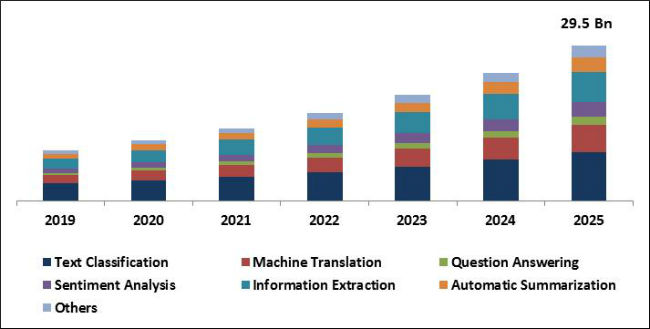

# Business Application: Quantum Natural Language Processing (QNLP)

.

## Introduction to Qlinguo

#### Qlinguo is a software service that translates human language into machine language.

In science fiction, computers will sometimes say "does not compute" when faced with human emotions.
Qlinguo is a platform that *will* compute. Specifically, our platform will translate *human* language,
with all its double entendres, sarcasm, and jargon, into *computer* language.
As of now, we have produced an early technical demonstration of how our technology would enable this feat.
Our work can be found at [Technical ReadMe](README.md).

#### See our presentation [here](https://drive.google.com/file/d/18cDZyMOz2K5DMXj6QvFpHl18n7QQZbOi/view?usp=sharing).

## Business Strategy

Our software service will automate business activities that require human language processing.
Our strategy is to begin (**phase 1**) with easier, better established use cases of such technology in order to demonstrate the superiority of our technology. Our focus at this early stage will be on improving technical support outcomes by automating client interaction. This is a competitive space but our "secret sauce", quantum technology, will give us a powerful edge.

Having established the competitive edge of our technology, we will progress (**phase 2**) to a problem that is currently intractable with current technology. This is the problem of identifying undesirables on social media. Our approach at this stage will be to progress from simpler versions of the problem (identifying "creeps" on dating websites) through to the more advanced forms (identifying "toxic content" on social media platforms like Twitter).

Finally (**phase 3**), we will tackle the most challenging problem that we believe has the highest payoff. This is the problem of legal compliance in large organisations. Currently, these large organisations need expensive teams of in-house legal counsel; most notably, to check for patent infringement. This is particularly difficult problem because legal text contains a great deal of bespoke jargon whose interpretation is precisely what is being debated. Furthermore, patents are often deliberately vague and so many possible interpretations must be considered. By automating even part of this process, we expect to significantly reduce legal costs for large organisations; especially those such as Samsung and Apple that have large and complex patent portfolios that are used in IP warfare.

The triggers for these transitions between phases are a combination of technological and commercial outcomes. We at each stage we validate our technology by demonstrating market viability. Dominance is desirable but not necessary until phase 3, where we expect minimal competition due to the overwhelming advantage of our technology. In the meantime, the revenue from these business activities will support the further development of the underlying technology in order to get ahead of current technological platforms. We are running a marathon, not sprinting.

.

## Technical Feasibility

From a technical standpoint, the problem we are solving is that of *sentiment analysis* in human speech and text. Sentiment analysis is the process of inferring what humans are *thinking* based on what humans are *saying*. Significant research and development resources are being directed at improving these outcomes. Qlinguo relies on quantum methods of natural language processing, as we explain below.

Quantum Natural Language Processing (QNLP) is an approach to semantic analysis which uses emerging quantum technology to process human language more accurately than any established technology. Current approaches to Natural Language Processing (NLP) are dominated by the so-called “bag of words” approach: where first a set of several thousand context words gets identified. From there, researchers use a corpus to determine how often other words appear near these context words (for example, next to “sports,” you’ll likely see mentions of “football,” “baseball,” “hockey,” and other closely related words). All these words come together to create the word vector for any particular word (in this case, the term “sports”).

This approach is typically referred to as a distributional approach to NLP and uses the vector space model to determine the meaning of words. A second approach to NLP called compositional model (also known as semantics), boils grammatical structures down to mathematical algorithms – essentially turning sentences into networks of words where these words interact to create meaning. Our approach combined the two previous approaches into something called the [“compositional distributional model”](https://arxiv.org/abs/1003.4394) implemented in a quantum computer. In our approach a direct correspondence is established on the one hand between the meanings of words and quantum states, and on the other hand grammatical structures and quantum measurements. This is done by encoding sentence networks into something a quantum circuit can understand.

During our work, we derived grammatical structure from sentences to analyze their sentiment. Compared to the classical 'Bag of Words' model for NLP; our model takes into account the technical details of Category theory. Category theory is important because it better enables us to look at the  interactions between elements of the sentence; as quantum computers grow in complexity we will be able to analyze larger, more complex sentences, easily matching the Classical NLP counterpart.

## NLP Industry Overview

[Image Source](https://www.techedgegroup.com/blog/how-to-select-a-chatbot-platform-for-your-business)

[Image Source](https://www.kbvresearch.com/natural-language-processing-market/)

According to [Mordor Intelligence](https://www.mordorintelligence.com/industry-reports/natural-language-processing-market):

> The Global NLP Market was valued at USD 10.72 billion in 2020, and it is expected to be worth USD 48.46 billion by 2026, registering a compound annual growth rate (CAGR) of 26.84% during th forecast period (2021-2026).

We aim to carve out a growing niche over the next 5-10 years in this market, with the aim of market dominance in about 10 years.

### Phase 1 Target Customers
|Company name example|Sub-segment|Segment|
|----|----|----|
| CDC, ECDC|Covid-19 related organizations|Healthcare|
|Vodafone,ATT|Telecoms|IT & telecom|
|BOA, Scotiabank, Federal Reserve Banks|Banks & Insurance|Finance|
|Seven eleven, Walmart| Supermarkets|Retail|
|R&D computer science schools|Schools, Colleges, Universities|Education|
|Reuters, Bloomberg|Financial data|Financial services|
|BetUS, Aleph Holding |Multiple types|Other End User Industries|

### Analysis of Competition

**Major players:**

|Company name|Profit 2020|
|----|----|
| Microsoft Corporation| $96.937B|
|Micro Focus International PLC.| $3 Billion|
| SAS Institute Inc.|$3 Billion|
| IBM Corporation.| $35.574B |
|Google Inc (Alphabet Inc.|$182.527B |

**Competitors for automation via chatbots (call center vertical):**

|Company name|Country| Founded|Capital raised|
|----|----|----|----|
| Nuance|USA|1992| $+25M|
|Next IT|USA|2002| $+15M|
|Mind Meld|USA |2011|$+25M|
|PypeStream|USA|2009|$+22.5M |

## References
[1] [Coecke, B. et al. Quantum Natural Language Processing](http://www.cs.ox.ac.uk/people/bob.coecke/QNLP-ACT.pdf)

[2] [Quantum Natural Language Processing Medium](https://medium.com/cambridge-quantum-computing/quantum-natural-language-processing-748d6f27b31d).

[3] [Applications of NLP | 5 Vital Applications of Natural Processing Language](https://www.educba.com/applications-of-nlp/).

[4] [Machine Translation Market](https://www.mordorintelligence.com/industry-reports/machine-translation-market).

[5] [Global Chatbot Market](https://www.marketdataforecast.com/market-reports/chatbot-market).
