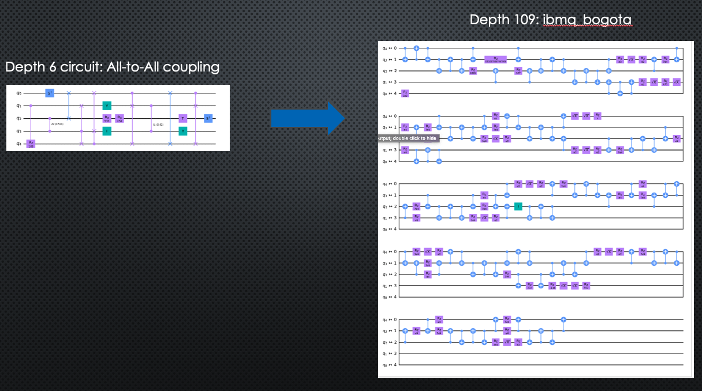

# Functorial Learning Business Application

Quantum algorithms are compiled into quantum circuits that implement the logical operations of the algorithm.  The current generation of quantum computers can support only shallow circuits -- those consisting of only tens of qubits and a limited number of logical operations before degradation of the quantum data and program failure.    Reducing  the size of quantum circuits that solve meaningful problems is therefore critical for realizing the power of  near-term power of quantum computers.  

Some quantum technologies, notably superconducting qubit devices, support only nearest-neighbor interactions between qubits. For example, IBM's quantum computer "kolkata" supports interactions shown in the following figure: 

Mapping an ideal quantum circuit to a device supporting nearest-neighbor interactions (known as transpiling) is required before running an algorithm on a real quantum computer.  Transpiling a quantum circuit increases the depth (or number of timesteps) of the actual quantum circuit that is executed on the hardware. The following figure shows how a depth 6 circuit on 5 qubits expands under transpiling to a circuit running on IBM's "bogota" quantum computer: 

Here we introduce What's The Functor?  -- a diagrammatic machine learning tool chain for predicting the cost of transpiling 
an ideal quantum circuit to a quantum computer supporting nearest-neighbor interactions.  By leveraging the powerful abstractions 
of functorial learning, WTF provides automated optimization and  quantum workload  provisioning services to  
quantum data centers for more efficient hardware utilization and stability. 

**Please store your video externally to the repo, and provide a link e.g. to Google Drive**
