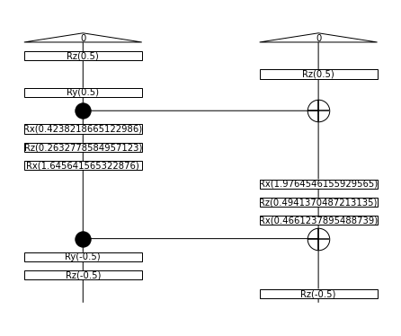
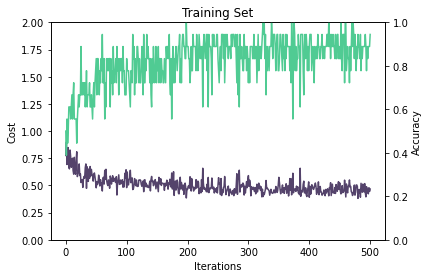
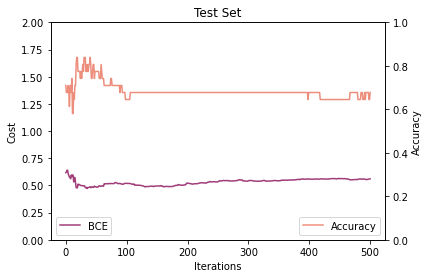
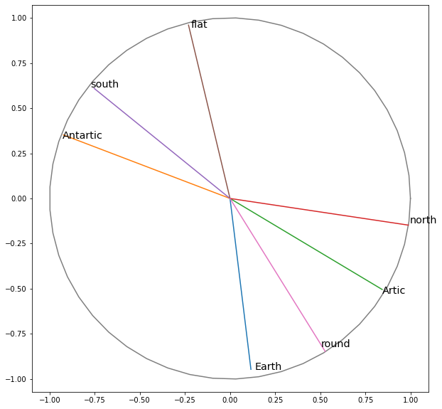
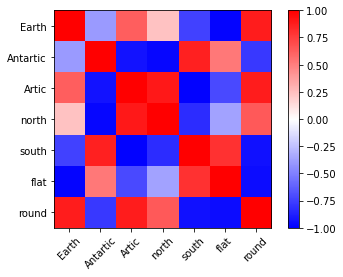
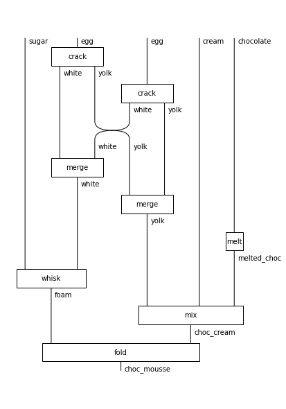
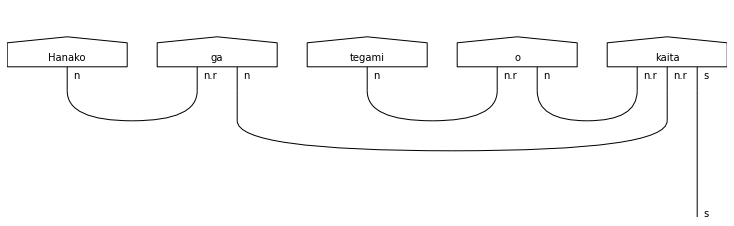
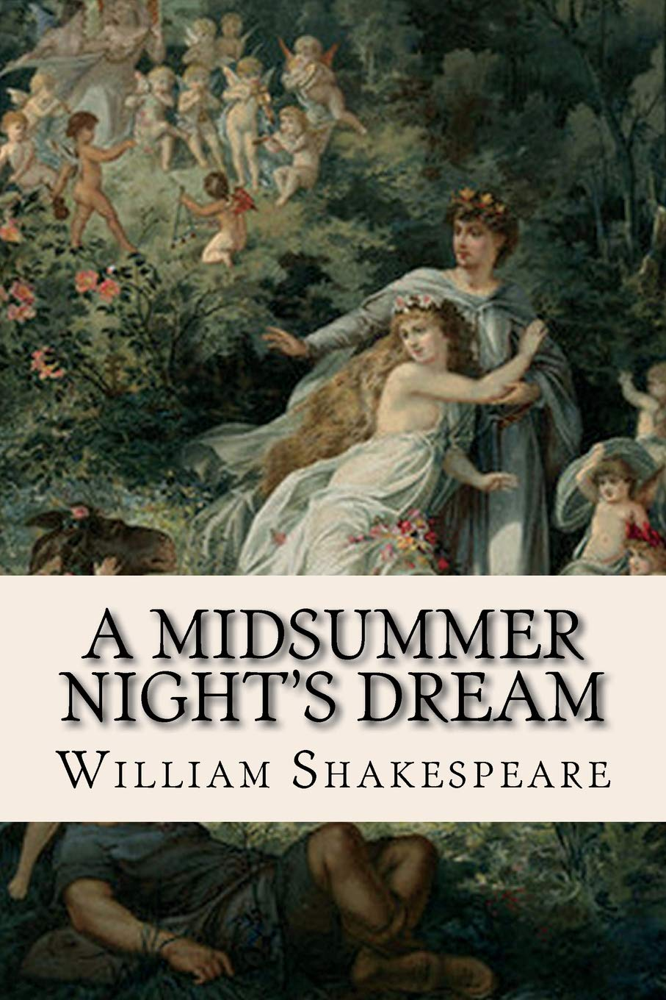
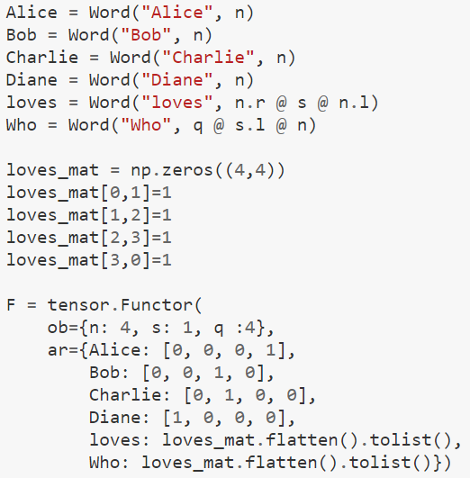

# Project 4: NLP: Natural Language Processing on a Quantum Computer 

## Table of Content

1. For Business use cases, please refer to the [Business Application found here](./Business_Application.md)
2. For the Solution to the tutorial (Task 1), please refer to the [tutorial solution found here](./solutions_tutorial.md)
3. For the custom QNLP pipeline (Task 2 + Task 3), please refer to the [QNLP solution found here](./solutions_QNLP.md)

## Executive Summary

### QNLP pipeline

We built a model to classify sentences into "True" or "False" on a limited semantic space. Namely we are going to fight the flat earth theory. We have a set of sentences some are True = 1 and some are False = 0, Training data sample is shown Below :
- Earth is round :  1
- Antartic is south :  1
- Artic is Antartic :  0
- Earth is flat :  0

We define an ansatzes for:
* **Nouns** three real parameters reprenting the three Euler rotations for each noun, the example for "Earth" is shown on the left.
* **Verbs** six real parameters for the only transitive verb in our semantic space "is", shown the right. 

<table>
        <tr>
            <td></td>
            <td></td>
        </tr>
</table>

We define the loss function to optimise as the Binary Cross Entropy and we also monitor the accuracy. On the below graph we show how this metrics progress as iterations go by, for the training set on the left and the testing set on the right

<table>
        <tr>
            <td></td>
            <td></td>
        </tr>
</table>

As a result of the training process we have learned rotation parameters for each word. In particular each Noun is encoded into a generic 1-qubit state, in the form psi = a |0> + b |1>. We can display any qubit into the bloch sphere. We evaluate the diagram for each Noun and map the resulting qubit encoding to the bloch coordinates for each noun. The results are plotted it in the diagram below, in a projection chosen by hand that shows the best information. We also display the similarity, defined as the dot product, between all words in the heatmap on the right.

What we can observe as general rules of thumb is that :
1. similar concepts are close together (e.g. "earth" is close to "round", "Artic" is close to "North")
2. opposite concepts are on the oposite side of the circle (e.g. "north" is away from "south", "round" is away from "flat"
3. unrelated concepts are orthogonal (e.g. "earth "and "north", "antartic" and "flat")

<table>
        <tr>
            <td></td>
            <td></td>
        </tr>
</table>

### Tutorial Notebook

Thanks to the `discopy` library :

* we implemented a chocolate mousse recipe :

<table>
        <tr>
            <td></td>
            <td></td>
        </tr>
</table>

* We implemented a grammar diagram for a japanese sentence

<table>
        <tr>
            <td></td>
            <td></td>
        </tr>
</table>

* We implemented Shakespeare's Midsummer Night Dream romantic relationship pattern :

<table>
        <tr>
            <td></td>
            <td></td>
        </tr>
</table>

## Business

The pitch video can be found below :

