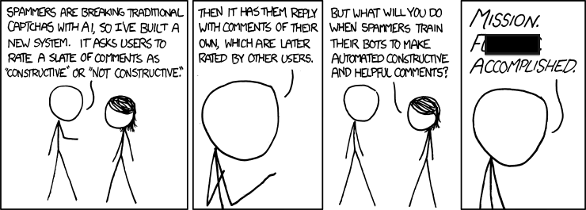

# Cohort Project Week 4 (Team 8)
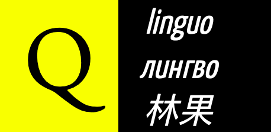
## Introduction

In this Cohort project, we implement quantum natural machine learning with [`discopy`](https://github.com/oxford-quantum-group/discopy) and [`pytket`](https://github.com/CQCL/pytket). We solve all the exercies in the `qnlp-tutorial` [notebook](https://github.com/oxford-quantum-group/discopy/blob/main/docs/notebooks/qnlp-tutorial.ipynb).

Solution Notebooks:

Tasks 1 to 4: [`qnlp_tutorial_solution_Task_1-4.ipynb`](./notebooks/qnlp_tutorial_solution_Task_1-4.ipynb)

Tasks 5: [`qnlp_tutorial_solution_Task_5.ipynb`](./notebooks/qnlp_tutorial_solution_Task5.ipynb)

## Installation Guide

To run the notebooks in this project, create a new conda environment to install the essential packages.

```
conda create -n env_name
conda activate env_name
```
Then install the following packages by

```
conda install python
pip install discopy
pip install pytket
pip install pytket-qiskit
pip install tensornetwork
```


----Add images if needed (put the images in ./images/)---

**Exercise 1-1:** Draw your favorite cooking recipe as a diagram. You'll want to keep your ingredients in order if you want to avoid swapping them too much.

- We create a four eggs omelette recipe with vegetables/bacon and cheese options.

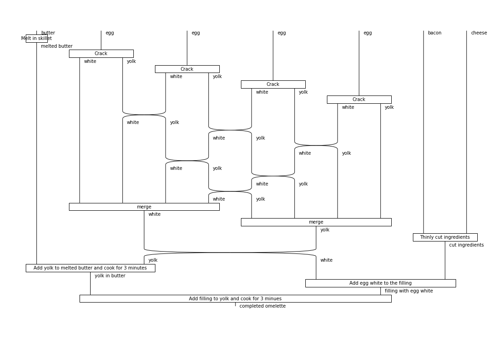

**Exercise 1-2:** Define a function that takes a number `n` and returns the recipe of a tiramisu with `n` layers of crema di mascarpone and savoiardi.

- add description

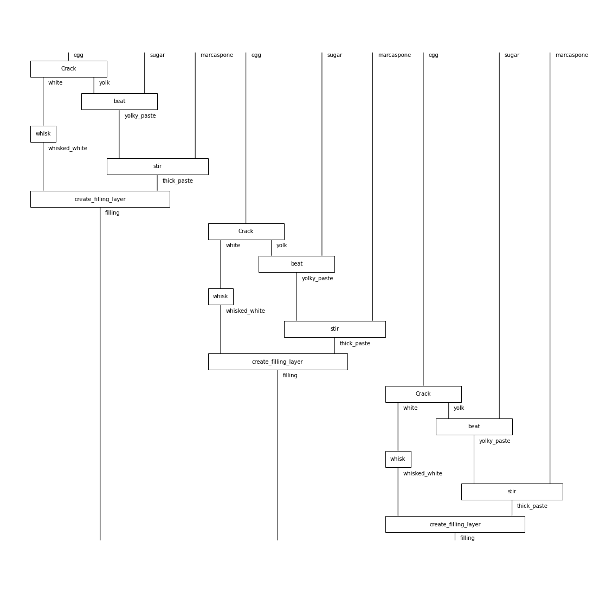


**Exercise 1-3 (harder):** Define a function that takes a number `n` and returns the recipe for cracking `n` eggs.

- add description

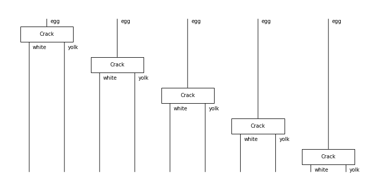

**Exercise 1-4:** Define a functor that translate your favorite language to English, try composing it with `english2french`.

- add description

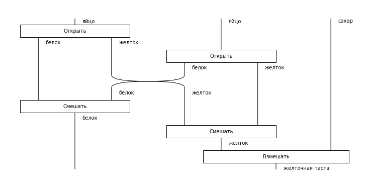


**Exercise 1-5:** Define a `french2english` functor, check that it's the inverse of `english2french` on a small example.

- add description


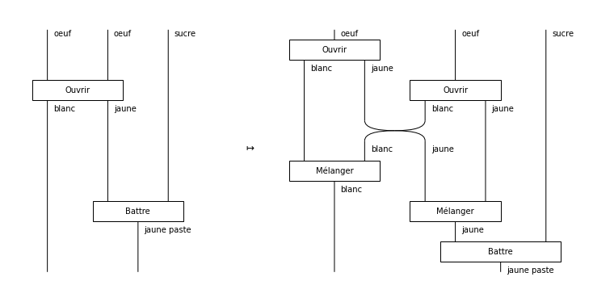
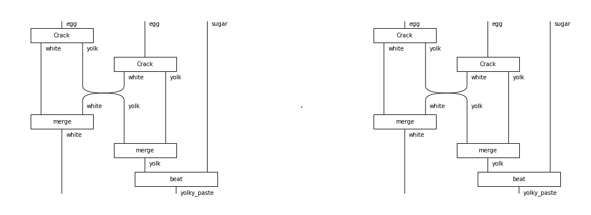


**Exercise 2-1:** Check out the [diagram rewriting](https://discopy.readthedocs.io/en/main/notebooks/rewriting-diagrams.html) notebook to learn how to remove snakes from a diagram. This can greatly speed up the evaluation of tensor diagrams!

- add description

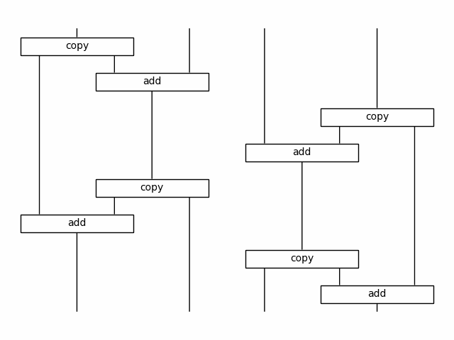
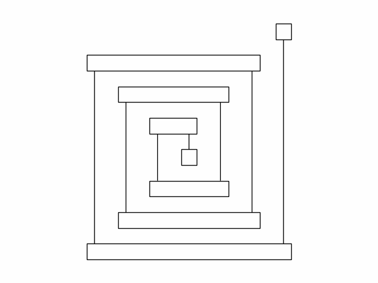
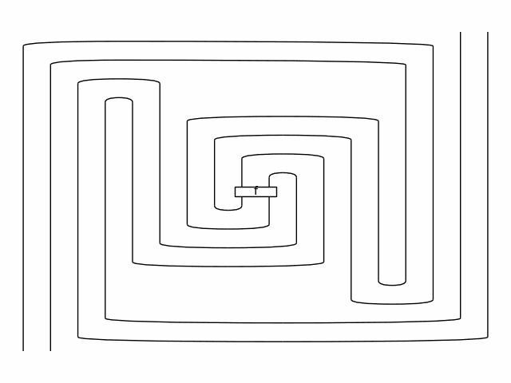


**Exercise 2-2:** Define a function that takes a number `n` and returns the diagram for a [matrix product state](https://en.wikipedia.org/wiki/Matrix_product_state) (MPS) with `n` particles and random entries. Check how the evaluation time scales with the size of the diagram. 

**Exercise 2-3:** Pip install the [tensornetwork](https://pypi.org/project/tensornetwork/) library and use it to contract the MPS diagrams more efficiently. This is done with the syntax `diagram.eval(contractor=tn.contractor.auto)`, see the [docs](https://discopy.readthedocs.io/en/main/_autosummary/discopy.tensor.Diagram.html#discopy.tensor.Diagram.eval).

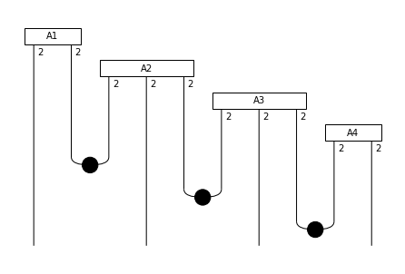

- For Exercies 2-2 and 2-3, we define a function returning the diagram for a matrix product state with a size `n`. The diagram for `n` = 5 is shown above. We also compare the evaluation time between `DisCoPy` and `tensornetwork` with respective to the size of the diagram. As shown below, the evaluation time for the discopy significantly increases as `n` > 8. However, `tensornetwork` performs much efficiently at higher diagram size.

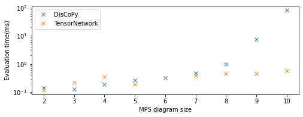


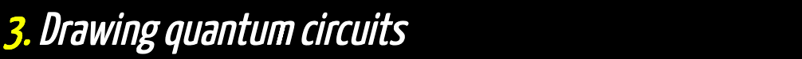

**Exercise 3-1:** Run your own Bell experiment on quantum hardware! You can use IBMQ machines for free, if you're ready to wait.
**Exercise 3-2:** Draw a circuit that evaluates to the GHZ state 
$\frac{1}{\sqrt{2}} (|000\rangle + |111\rangle)$.
**Exercise 3-3 (harder):** Define a function that takes a number `n` and returns a circuit for the  state $\frac{1}{\sqrt{2}} (|0...0\rangle + |1...1\rangle)$.

- In this exercise we use `pytket` to convert the `discopy` circuit diagram for the Bell state (see below) and access the IBMQ backend `bogota` to measure the Bell state. 
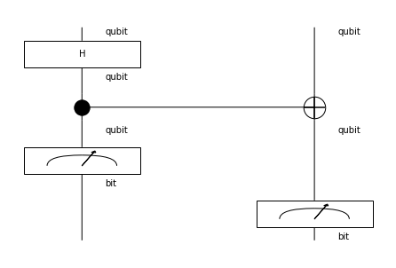

The result shows that $|00\rangle$ and $|11\rangle$ states have nearly equal probabilities.

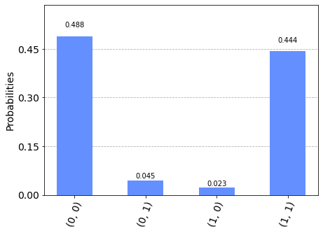

-In

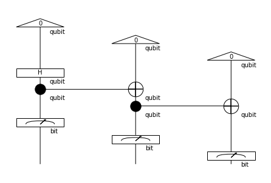


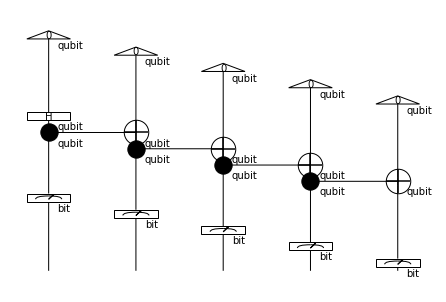
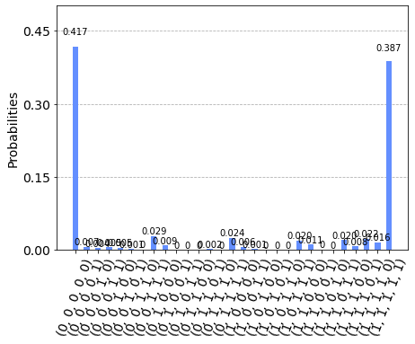


For more details refer to the [Business Application found here](./Business_Application.md)
 
 
   
   
 
  
  
