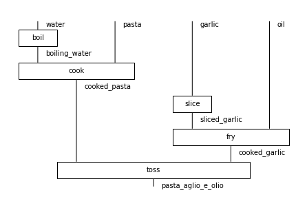
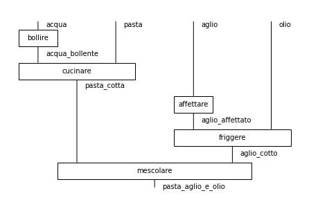
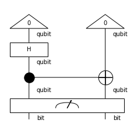
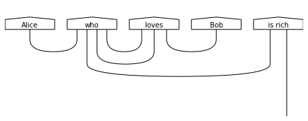
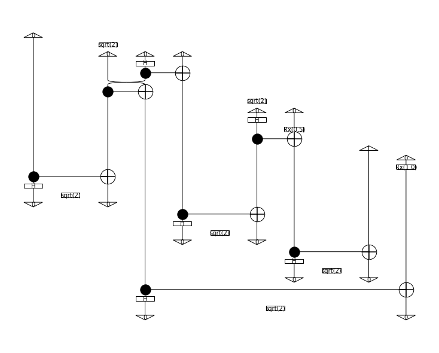

## Project 4: NLP: Natural Language Processing on a Quantum Computer

## Notebooks

**[QNLP Exercises:](./notebooks/1_qnlp-exercises.ipynb)** In this notebook, we run through the exercises contained in the [QNLP Tutorial](./notebooks/0_qnlp-tutorial.ipynb).
  

- We designed diagrams for cooking recipes:

    

- Translated those recipes:

    

- Turned diagrams into circuits:

    

- Constructed simple sentence grammars:

    
    

**[QNLP Experiment:](./notebooks/3_qnlp-experiment.ipynb)** In this notebook, we generate a corpus from a small set of nouns and verbs, and then simulate a small-scale QNLP experiment.

- We constructed some simple sentences:

    

- Constructed circuits from the sentences:

    

- And simulated them to check who loved who (and who was rich).

## [Business Application](business_application.md)
