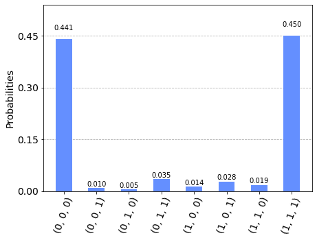
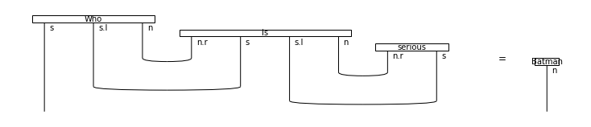

# Cohort Project Week 4 (Team 8)


# Table of contents
1. [Introduction](#introduction)
2. [Tensors as boxes](#paragraph2)
3. [Drawing Quantum Circuits](#paragraph3)
4. [Drawing Grammatical Structure](#paragraph4)
5. [Putting it all together: QNLP](#paragraph5)


## Introduction <a name="introduction"></a>

In this Cohort project, we implement quantum natural machine learning with [`discopy`](https://github.com/oxford-quantum-group/discopy) and [`pytket`](https://github.com/CQCL/pytket). We solve all the exercies in the `qnlp-tutorial` [notebook](https://github.com/oxford-quantum-group/discopy/blob/main/docs/notebooks/qnlp-tutorial.ipynb).

Solution Notebooks:

Tasks 1 to 4: [`qnlp_tutorial_solution_Tasks_1_to_4.ipynb`](./qnlp_tutorial_solution_Tasks_1_to_4.ipynb)

Task 5-1: [`qnlp_tutorial_solution_Task5-1.ipynb`](./qnlp_tutorial_solution_Task5-1.ipynb)

Task 5-2: [`qnlp_tutorial_solution_Task5-2_SWAP_test.ipynb`](./qnlp_tutorial_solution_Task5-2_SWAP_test.ipynb)

## Installation Guide

To run the notebooks in this project, create a new conda environment to install the essential packages.

```
conda create -n env_name
conda activate env_name
```
Then install the following packages by

```
conda install python
pip install discopy
pip install pytket
pip install pytket-qiskit
pip install tensornetwork
```
<a name="paragraph1"></a>


**Exercise 1-1:** Draw your favorite cooking recipe as a diagram. You'll want to keep your ingredients in order if you want to avoid swapping them too much.

- We create a four eggs omelette recipe with vegetables/bacon and cheese options.
<p align = center>

```py
 
```
**Exercise 1-2:** Define a function that takes a number `n` and returns the recipe of a tiramisu with `n` layers of crema di mascarpone and savoiardi.

- We create the tiramisu recipe and duplicate it for multiple layers of filling


**Exercise 1-3 (harder):** Define a function that takes a number `n` and returns the recipe for cracking `n` eggs.

- We create a function drawing a diagram describing the cracking (and merging) mutliple eggs 


**Exercise 1-4:** Define a functor that translate your favorite language to English, try composing it with `english2french`.

- This diagram shows the translation of a recipe from English to Russian


**Exercise 1-5:** Define a `french2english` functor, check that it's the inverse of `english2french` on a small example.

- Here we convert the recipe back to english

|||
| :---------: | :----------: |
||  |

<a name="paragraph2"></a>


**Exercise 2-1:** Check out the [diagram rewriting](https://discopy.readthedocs.io/en/main/notebooks/rewriting-diagrams.html) notebook to learn how to remove snakes from a diagram. This can greatly speed up the evaluation of tensor diagrams!

| | | | 
| :---------: | :----------: | :----------: |
|  |  | | 


**Exercise 2-2:** Define a function that takes a number `n` and returns the diagram for a [matrix product state](https://en.wikipedia.org/wiki/Matrix_product_state) (MPS) with `n` particles and random entries. Check how the evaluation time scales with the size of the diagram. 

**Exercise 2-3:** Pip install the [tensornetwork](https://pypi.org/project/tensornetwork/) library and use it to contract the MPS diagrams more efficiently. This is done with the syntax `diagram.eval(contractor=tn.contractor.auto)`, see the [docs](https://discopy.readthedocs.io/en/main/_autosummary/discopy.tensor.Diagram.html#discopy.tensor.Diagram.eval).

 

- For Exercies 2-2 and 2-3, we define a function returning the diagram for a matrix product state with a size `n`. The diagram for `n` = 5 is shown above. We also compare the evaluation time between `DisCoPy` and `tensornetwork` with respective to the size of the diagram. As shown below, the evaluation time for the discopy significantly increases as `n` > 8. However, `tensornetwork` performs much efficiently at higher diagram size.


 
 
<a name="paragraph3"></a>
 


In this task we use `pytket` to convert the `discopy` circuit diagrams for the Bell state ($\frac{1}{\sqrt{2}}(|00 \rangle+|11 \rangle)$, GHZ state ( $\frac{1}{\sqrt{2}}(|000\rangle+|111\rangle$), and the generalized n-qubit fully entangled state $\frac{1}{\sqrt{2}}(|00000\rangle+|11111\rangle$ (see below) and access the IBMQ backend `bogota` to perform the measurements. 

**Circuit for the Bell state:**

 

  
**Bell state measurement:** The result shows that $|00\rangle$ and $|11\rangle$ states have nearly equal probabilities.

 

 
**Circuit for the GHZ state:** 

  

**GHZ state measurement:** The result shows that $|000\rangle$ and $|111\rangle$ states have nearly equal probabilities.

 

**Circuit for the `n=5` entangled state:** 

 
 
**`n=5` entangled state measurement:** The result shows that $|00000\rangle$ and $|11111\rangle$ states have nearly equal probabilities.

 

<a name="paragraph4"></a>


**Exercise 4-1:** Draw the diagram of a sentence in a language with a different word order, e.g. Japanese.

In task4 we were charged with drawing the grammatical structure of sentences using diagrams. There we several exercises which tested this ability. For example, in one task we drew the diagrm to the sentence "Alice loves Bob" in japanese (where the sentence structure is not subject-verb-noun).


**Exercise 4-2:** Draw the diagram of a sentence in a language written right to left, e.g. Arabic

We implemeted the same sentence in arabic, where the sentence is read right to left.


**Exercise 4-3:** Check out Lambek's From word to sentence, pick your favorite example and implement it in DisCoPy.

We were also tasked with implementing a sentence from Lambek's classic paper. We chose the sentence, "cannibals prefer men to pork".


These tasks were more focused on practicing the drawing of the diagrams. The next three tasks enabled us to see how we could pry the grammatical structure from the diagrams. 

**Exercise 4-4:** Draw your favorite sentence, define the meaning of each word then evaluate it as a tensor.

For example, we first had to draw our favourite sentence and evaluate it as a tensor. We chose the sentence 'Batman is serious' (as a parody of the famous line from the Joker- why so serious). So we evaluated the sentence: who is serious?- and we obtained the correct response of Batman.



**Exercise 4-5:** Build a toy model with a 4-dimensional noun space, add Charlie and Diane to the story.

next, we created a 4 noun wordspace with 4/5 of our group members. We added further difficulty by enabling interactions between multiple members of the noun space. For example, Eli and Yuval like eachother, but Eli and Ming are not so friendly:


**Exercise 4-6:** Define the meaning of the word Does and draw the diagram for the yes-no question Does Alice love Bob?. The meaning of the question should be the same as the sentence Alice loves Bob, i.e. the answer is "yes" if the sentence is true.

The final exercise for task4 had us evaluating the question 'Does Alice love Bob'. Here is a diagram of the question; it's a normalized diagram, since the word 'does' isn't contributing any grammatical structure to the sentence.


By looking in the notebbok you can confirm we obtain the correct response of 'yes' for this task.

<a name="paragraph5"></a>


**Exercise 5-1:** Run your own QNLP experiment on quantum hardware! There are multiple parameters that you can try to scale: the length of sentences, the size of the vocabulary, the number of qubits for the noun space.


Our first exercise for task5 was to train a QNLP model using circuits to answer the types of questions (such as 'Does Alice love Bob') seen in task4. We were able to efficiently create the diagrams and circuits in this task. To supplement this task, we also included a classical NLP model, which can be seen in [this notebook](Classical_NLP.ipynb). Implementations of exercise 1 from Task 5 are found in [this notebook](qnlp_tutorial_solution_Task5-1.ipynb) and also in [this notebook](task5_implement2.ipynb).

**Exercise 5-2:** Implement a swap test to compute whether "Alice" is an answer to "Who loves Bob?".

In our second exercise for task5 we were required to perform a SWAP test to verify whether "Alice" is the answer of "Who loves Bob?" by performing the following steps:

1. We use the [online generator]( https://qnlp.cambridgequantum.com/generate.html) to generate the circuits for "Who loves Bob?" and "Alice" individually. Then we use random parame between 0 and 1 into the parameters of these circuits.
2. **Implement the SWAP test circuit**. In `discopy`, there is no build-in implementation for the controlled-SWAP gate. We have tried to use the built-in CSWAP gate in`pytket` and translate it into a `discopy.Circuit`. However, it produced an`Implement Error`. Fortunately, we found a way to use the transpiler in `qiskit` to decompose the `CSWAP` gate into single- and two- qubit gates. Then we manually type up the transpiled circuit into a `pytket` circuit, then translate it into a `discopy` circuit. 
3. Combine the circuits of the "Who loves Bob?", "Alice", and the SWAP test, as shown below.


4. Measure the ancilla qubit with the simulator `Aerbackend` in `qiskit`  because this problem requires 8 qubits but there is no publically available quantum processors with more than 8 qubits yet. The result shows that the probability of measuring $|0\rangle$ is about 0.6 to 0.8, depending on the random initial parameters, which indicates that "Alice" is likely to be the correct answer.


For more details refer to the [Business Application found here](./Business_Application.md)
 

 
   
   
 
  
  
