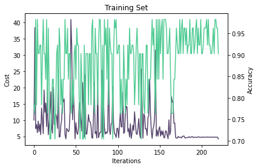
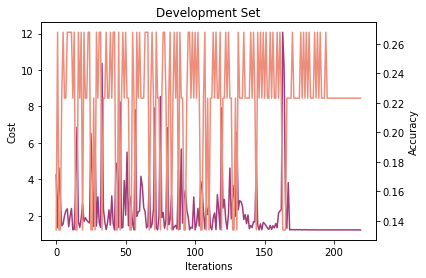
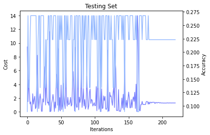

## Project 4: NLP: Natural Language Processing on a Quantum Computer 

This project will guide you through running your own QNLP experiment. 

Open up [instructions.pdf](https://github.com/CDL-Quantum/CohortProject_2021/tree/main/Week4_NLP/instructions.pdf) to begin learning about your tasks for this week!

**Please edit this markdown file directly with links to your completed tasks and challenges.**

## Task 1

Please review the [notebook](./Task_1_Experiment.ipynb) for more detailed results.

### Section 1

**Exercise:** Draw your favorite cooking recipe as a diagram. You'll want to keep your ingredients in order if you want to avoid swapping them too much.

We build a recipe for bok choy. The resulting recipe is drawn as such:

**Exercise:** Define a function that takes a number `n` and returns the recipe of a tiramisu with `n` layers of crema di mascarpone and savoiardi.

We built a function `make_tiramisu` and show the resulting recipies for *three* and *five* layers. 

| Three Layer Tiramisu Recipe | Five Layer Tiramisu Recipe |
| - | - |
|  |  | 

**Exercise (harder):** Define a function that takes a number `n` and returns the recipe for cracking `n` eggs.

We build the function `crack_n_eggs` and show its output for *four* eggs:

**Bonus:** Build a recipe for creating pancakes. 

We built logic to create a pancake recipe. Our resulting output is shown below: 

**Exercise:** Define a functor that translate your favorite language to English, try composing it with `english2french`.

Not yet completed.

**Exercise:** Define a `french2english` functor, check that it's the inverse of `english2french` on a small example.

Not yet completed.

### Section 2 

**Exercise:** Check out the [diagram rewriting](https://discopy.readthedocs.io/en/main/notebooks/rewriting-diagrams.html) notebook to learn how to remove snakes from a diagram. This can greatly speed up the evaluation of tensor diagrams!

We implemented this and show the result below:

**Exercise:** Define a function that takes a number `n` and returns the diagram for a [matrix product state](https://en.wikipedia.org/wiki/Matrix_product_state) (MPS) with `n` particles and random entries. Check how the evaluation time scales with the size of the diagram. 

Not yet completed.

**Exercise:** Pip install the [tensornetwork](https://pypi.org/project/tensornetwork/) library and use it to contract the MPS diagrams more efficiently. This is done with the syntax `diagram.eval(contractor=tn.contractor.auto)`, see the [docs](https://discopy.readthedocs.io/en/main/_autosummary/discopy.tensor.Diagram.html#discopy.tensor.Diagram.eval).

Not yet completed.

### Section 3

Not completed.

**Exercise:** Run your own Bell experiment on quantum hardware! You can use IBMQ machines for free, if you're ready to wait.

**Exercise:** Draw a circuit that evaluates to the GHZ state $\frac{1}{\sqrt{2}} (|000\rangle + |111\rangle)$.

**Exercise (harder):** Define a function that takes a number `n` and returns a circuit for the  state $\frac{1}{\sqrt{2}} (|0...0\rangle + |1...1\rangle)$.

### Section 4

Note that although in this tutorial we draw all our diagram by hand, this parsing process can be automated. Indeed once you fix a **dictionary**, i.e. a set of words with their possible grammatical types, it is completely mechanical to decide whether a sequence of words is grammatical. More precisely, it takes $O(n^3)$ time to decide whether a sequence of length $n$ is a sentence, and to output the diagram for its grammatical structure.

Such a dictionary is called a **pregroup grammar**, introduced by Lambek in 1999 and has been used to study the syntax of English, French, Persian and a dozen of other natural languages. Note that pregroup grammars are as expressive as the better known **context-free grammar**, where the diagrams are called **syntax trees**.

**Exercise:** Draw the diagram of a sentence in a language with a different word order, e.g. Japanese.

**Exercise:** Draw the diagram of a sentence in a language written right to left, e.g. Arabic.

We will translate Cat ate the mouse into URDU.  
This language is similar to Arabic in that it is read right to left. 
The grammar is also different as we would say "cat did mouse eat"
The actual Urdu text is shown below:

بلی نے چوہا کھایا

This would be pronounced "billi nay chooha khaya". Here is the mapping we created (this should be read from right to left):

**Exercise:** Draw your favorite sentence, define the meaning of each word then evaluate it as a tensor.

Our favorite sentence is "Cat Ate the Mouse" which is depicted in this diagram:

In the [notebook](./Task_1_Experiment.ipynb), we also define the meaning of each word and evaluate it as a tensor.

**Exercise:** Build a toy model with a 4-dimensional noun space, add `Charlie` and `Diane` to the story.

We solved this using the previous formulation. The resulting diagram is shown here: 

### Section 5

Not done

## Task 2

We built a spam detector. The notebook can be found [here](./Task_2_and_3_QNLP_Experiment.ipynb) which contains the work for both task 2 and 3.

Here we generate a vocabulary of words with positional tags.  This is translated into a set of data with correct, and incorrect sentences which correspond to lables 1's and 0's respectively.  This data is split up into a training,development, and test set.  The sentences are translated along with their grammer are translated into diagrams with discopy, and then into corresponding parameterized quantum circuits.  We then use the data labels and  a classical optimizer to optimize these circuits, and then calculate a classification value 1 or 0 for each sentence.  This allows use to test different sentences of similar for, but with different vocabulary to identify spam vs real email sentences for example.

We show our resulting diagrams here. On the left is the english word representation, on the right is the corresponding circuit diagram. 

| English Representation | Circuit Diagram |
| - | - |
|  | 

## Task 3

Task 3 notebook can be found [here](./Task_2_and_3_QNLP_Experiment.ipynb) (please scroll down in the notebook).

This is running the experiment from task 2 with the quantum circuit.

We did training and we show the learning curve (training set, the development curve and the testing curve).

| Training | Development | Testing | 
| - | - | - |
|  |  |  | 

## Business Application
For each week, your team is asked to complete a Business Application. Questions you will be asked are:

* Explain to a layperson the technical problem you solved in this exercise.
* Explain or provide examples of the types of real-world problems this solution can solve.
* Identify at least one potential customer for this solution - ie: a business who has this problem and would consider paying to have this problem solved.
* Prepare a 90 second video explaining the value proposition of your innovation to this potential customer in non-technical language.

For more details refer to the [Business Application found here](./Business_Application.md)
