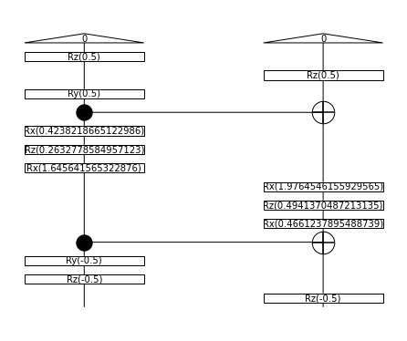

# Project 4: QNLP pipeline solution

**Reference Code** can be foun in [this notebook](./QNLP_notebook.ipynb)

## The Problem and the Data
The problem we are going to solve is to build a model to classify sentences into "True" or "False" on a limited semantic space. Namely we are going to fight the flat earth theory. We have a set of sentences some are true and some are False, some examples are shown below.

**FALSE** Flat earth theory:
* Earth is flat
* Arctic is in the center
* Sun revolves around Earth

**TRUE** Reality :
* Earth is round
* Arctic is the North Pole
* Earth revolves around the Sun

<table>
        <tr>
            <td></td>
        </tr>
</table>

Our initial Idea was to work on the above dataset but the complexity of the task lead us to reduce it to a simpler problem with 7 nouns ('Earth', 'Antartic', 'Artic', 'north', 'south', 'flat', 'round') and one verb ('is'). We created a tool to easily label training data manually and store it, with two options : brute force or random. We use the Brute Force one for the Training.=, which means we have all the combination of word x word = 7 x 7 = 49.

## From Diagrams to Quantum Circuits

We define an ansatz for 

* **Nouns** with three real parameters reprenting the three Euler rotations Rx(p0) >> Rz(p1) >> Rx(p2). An example with random parameters is shown for the Noun "Earth", with the diagram on the left and the quantum circuit on the right.

<table>
        <tr>
            <td></td>
            <td></td>
        </tr>
</table>

* **Verbs** more specifically the only transitive verb in our semantic space "is". We define a generic U4 unitary as an ansatz with six real parameters. The verb is is shown below, with the diagram on the left and the quantum circuit on the right.

<table>
        <tr>
            <td></td>
            <td></td>
        </tr>
</table>

A **sentence** is done composing a Noun with a Verb with a Noun, an example is shown below, with the diagram on the top and the quantum circuit on the bottom.

<table>
        <tr>
            <td></td>
        </tr>
        <tr>
            <td></td>
        </tr>
</table>

## Training Process

## results

Each word is encoded into a generic 1-qubit state, in the form psi = a |0> + b |1> with a,b complex number and (a,b) L2 norm = 1. We can plot any qubit into the bloch sphere (fig on the left). We do map the resulting qubit encoding to bloch coordinates for each noun and plot it in the diagram below, in the projection that shows the best information. What we can observe as general rules of thumb is that :
1. similar concept are close together (e.g. "earth" is close to "round", "Artic" is close to "North")
2. opposite concepts are on the oposite side of the circle (e.g. "north" is away from "south", "round" is away from "flat"
3. unrelated concepts are orthogonal (e.g. "earth "and "north", "antartic" and "flat")

<table>
        <tr>
            <td></td>
            <td></td>
        </tr>
</table>

