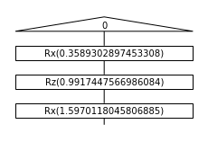
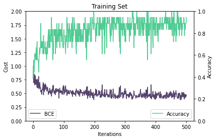
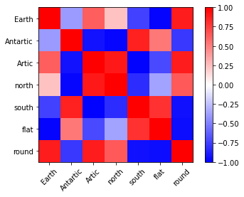

# Project 4: QNLP pipeline solution

**table of contents**

1. To go back to the Readme [please click here](./README.md)
2. To explore Business use cases, please refer to the [Business Application found here](./Business_Application.md)
3. To explore the tutorial solution (Task 1), please refer to the [tutorial solution found here](./solutions_tutorial.md)

**Reference Code** can be foun in [this notebook](./QNLP_notebook.ipynb)

## The Problem and the Data
The problem we are going to solve is to build a model to classify sentences into "True" or "False" on a limited semantic space. Namely we are going to fight the flat earth theory. We have a set of sentences some are true and some are False, some examples are shown below.

**FALSE** Flat earth theory :
* Earth is flat
* Arctic is in the center
* Sun revolves around Earth

**TRUE** Reality :
* Earth is round
* Arctic is the North Pole
* Earth revolves around the Sun

<table>
        <tr>
            <td></td>
        </tr>
</table>

Our initial idea was to work on the above full dataset but the complexity of the task lead us to reduce it to a simpler problem with 7 nouns ('Earth', 'Antartic', 'Artic', 'north', 'south', 'flat', 'round') and one verb ('is'). We created a tool to easily label training data manually and store it, with two options : brute force or random. We use the Brute Force one for the Training.=, which means we have all the combination of word x word = 7 x 7 = 49.

## From Diagrams to Quantum Circuits

We define an ansatz for :

* **Nouns** with three real parameters reprenting the three Euler rotations Rx(p0) >> Rz(p1) >> Rx(p2). An example with random parameters is shown for the Noun "Earth", with the diagram on the left and the quantum circuit on the right.

<table>
        <tr>
            <td></td>
            <td></td>
        </tr>
</table>

* **Verbs** more specifically the only transitive verb in our semantic space "is". We define a generic U4 unitary as an ansatz with six real parameters. The verb "is" is shown below it randomised parameters, with the diagram on the left and the quantum circuit on the right. Only the 6 boxes in the middle with random numbers have free a parameter.

<table>
        <tr>
            <td></td>
            <td></td>
        </tr>
</table>

A **sentence** is done composing a Noun with a Verb with a Noun, an example is shown below, with the diagram on the top and the quantum circuit on the bottom.

<table>
        <tr>
            <td></td>
        </tr>
        <tr>
            <td></td>
        </tr>
</table>

## Training Process

There is a class imbalance between the True sentences (13) and the False sentences (36). We take 9 samples (~75%) of each class as training data. We therefore have 18 samples for training and 31 for testing. Training data :
- Earth is round :  1
- round is Earth :  1
- Antartic is Antartic :  1
- north is north :  1
- flat is flat :  1
- Antartic is south :  1
- south is Antartic :  1
- round is round :  1
- north is Artic :  1
- Artic is Antartic :  0
- Earth is Antartic :  0
- flat is round :  0
- south is round :  0
- north is Earth :  0
- south is north :  0
- Earth is flat :  0
- Antartic is flat :  0
- flat is Artic :  0

We define the loss function to optimise as the Binary Cross Entropy, which is very common for binary classification task. Essentially for data point we add the logarithm of the probability of guessing the label right. It yields the following formula, where yt are the true labels and yp are the predicted label :

C = - ( yt * log(yp) + (1 - yp) * log ( 1- yp ) )

An additional metric we monitor is the accuracy, which is essentially  the percentage of correctly guessed labels.

On the below graph we show how this metrics progress as iterations go by, for the training set on the left and the testing set on the right

<table>
        <tr>
            <td></td>
            <td></td>
        </tr>
</table>

Even though the testing test shows overall a lower accuracy, there is no obvious overfitting, and the optimisation algorithm shows a reasonable convergence.

## Results Display and Analysis

As a result of the training process we have learned rotation parameters for each word. In particular each Noun is encoded into a generic 1-qubit state, in the form psi = a |0> + b |1>. We can display any qubit into the bloch sphere (on the left in the figure below). We evaluate the diagram for each Noun and map the resulting qubit encoding to the bloch coordinates for each noun. The results are plotted it in the diagram below, in a projection chosen by hand that shows the best information

<table>
        <tr>
            <td></td>
            <td></td>
        </tr>
</table>

. What we can observe as general rules of thumb is that :
1. similar concepts are close together (e.g. "earth" is close to "round", "Artic" is close to "North")
2. opposite concepts are on the oposite side of the circle (e.g. "north" is away from "south", "round" is away from "flat"
3. unrelated concepts are orthogonal (e.g. "earth "and "north", "antartic" and "flat")

We also display the similarity, defined as the dot product, between all words in the heatmap below :

<table>
        <tr>
            <td></td>
        </tr>
</table>

1. similar concepts -> aligned in the same direction -> 1 -> red
2. opposite concepts -> aligned in opposite directions -> -1 -> blue
3. unrelated concepts -> orthogonal -> 0 -> white/pale

Although it is parametrise in terms of angles the "is" verb can be represented in the form a|00> + b|01> + c|10> + d|11>, the complex vector (a,b,c,d) learned is shown below:

<table>
        <tr>
            <td></td>
        </tr>
</table>

## Discussion and Caveats

The parametrisation above is not perfect, for instance it has some degree of freedom, indeed shifting the entire space by a rotation in the bloch space would yield an equivalent mapping. Maybe fixing one word would help reduce this.

The representation used above allos a one qubit representation of words. For more complex semantic space, several qubit could be used, and the ability to represent complexity would increse exponentially with the number of qubits. Future work could include increaisng the number of qubit to 3 and using the full dataset.

In the above example we dont take full advantage of QNLP. Indeed we used one of the most simple grammar structures possible in the English Language. It would have been interesting to learn more complex sentence structure. For example "Antartic is not in the North, but in the South"=1. Which encodes more information than the simple structure. In that example it encodes roughly the same information as:  "Antartic is south" = 1, "Antartic is north"= 0, "north is south"= 0.

*If you have made it this far, congratulations, thank you for reading, and spread the word **EARTH IS NOT FLAT**, ad astra !*

**table of contents**

1. To go back to the Readme [please click here](./README.md)
2. To explore Business use cases, please refer to the [Business Application found here](./Business_Application.md)
3. To explore the tutorial solution (Task 1), please refer to the [tutorial solution found here](./solutions_tutorial.md)

