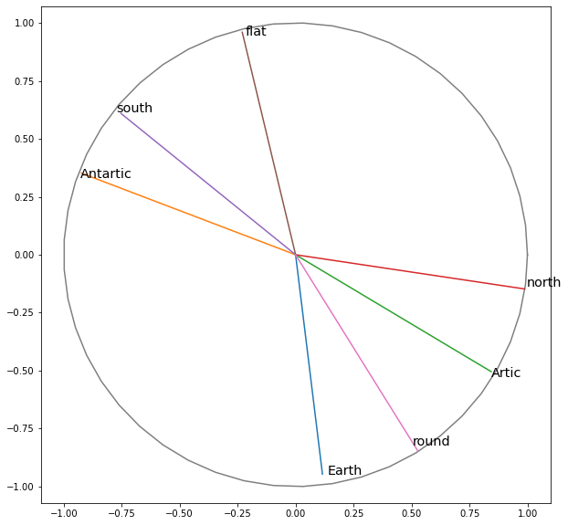

# Project 4: QNLP pipeline solution

**Reference Code** can be foun in [this notebook](./QNLP_notebook.ipynb)

## The Problem and the Data

## From Diagram to Quantum

## training

## results

Each word is encoded into a generic 1-qubit state, in the form psi = a |0> + b |1> with a,b complex number and (a,b) L2 norm = 1. We can plot any qubit into the bloch sphere (fig on the left). We do map the resulting qubit encoding to bloch coordinates for each noun and plot it in the diagram below, in the projection that shows the best information. What we can observe as general rules of thumb is that :
1. similar concept are close together (e.g. "earth" is close to "round", "Artic" is close to "North")
2. opposite concepts are on the oposite side of the circle (e.g. "north" is away from "south", "round" is away from "flat"
3. unrelated concepts are orthogonal (e.g. "earth "and "north", "antartic" and "flat")

<table>
        <tr>
            <td></td>
            <td></td>
        </tr>
</table>

