## Project 4: NLP: Natural Language Processing on a Quantum Computer 

**table of contents**

1. To go back to the Readme [please click here](./README.md)
2. To explore Business use cases, please refer to the [Business Application found here](./Business_Application.md)
3. To explore the custom QNLP pipeline (Task 2 + Task 3), please refer to the [QNLP solution found here](./solutions_QNLP.md)

# Technical Assignment : Tutorial

## Task 1

**Reference Code** :[Tutorial-Part1](qnlp-tutorial-Part1.ipynb)

Our task was to write the recipe of our favorite recipe, and chose chocolate mousse (who doesnt like it ?).

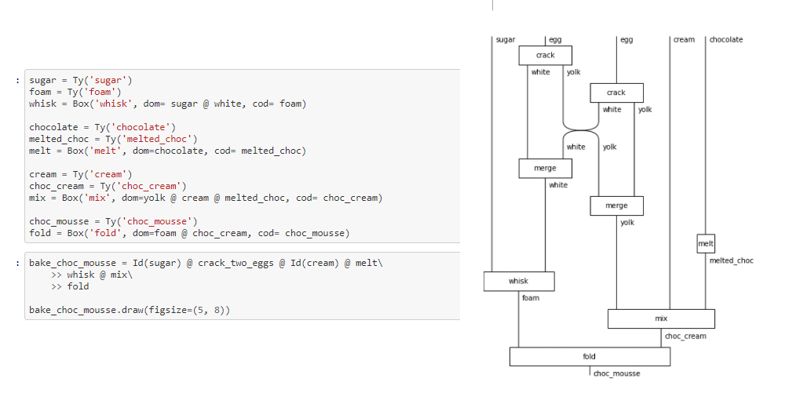

By swapping the white and yolk, we were able to get foam and choc cream. By combining two choc cream and foam, we were able to generate choc mousse. By far as we understand, this is the first generation of choc mousse in discopy environment, which is quite noticeable. Previous research [link](https://graphicallinearalgebra.net/2015/05/06/crema-di-mascarpone-rules-of-the-game-part-2-and-diagrammatic-reasoning/) already showed generation of Crema di Mascarpone, but the challenge was obtaining Mascarpone in grocery store. Therefore, our work enhanced previous studies by utilizing more accessible product to create choc mousse in discopy environment. 

As we prepare the choc mouse, we also replicate previous research on tiramisu generation, and successfully recreate multi-layer tiramisu with simple for-loop method. 

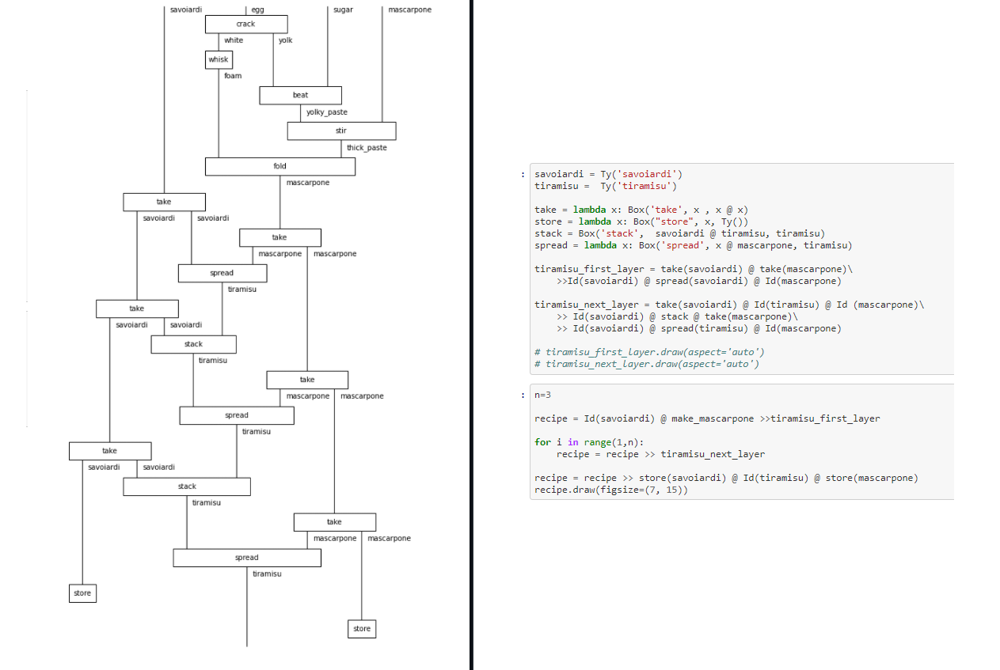

This diagram represents multi-layer structure of tiramisu, which can be easily replicated in average household. One of the main challenge of this work was that often requires large amount of eggs. This challenges was also integrated into our solution where we can easily scable the operation with N number of egg. 

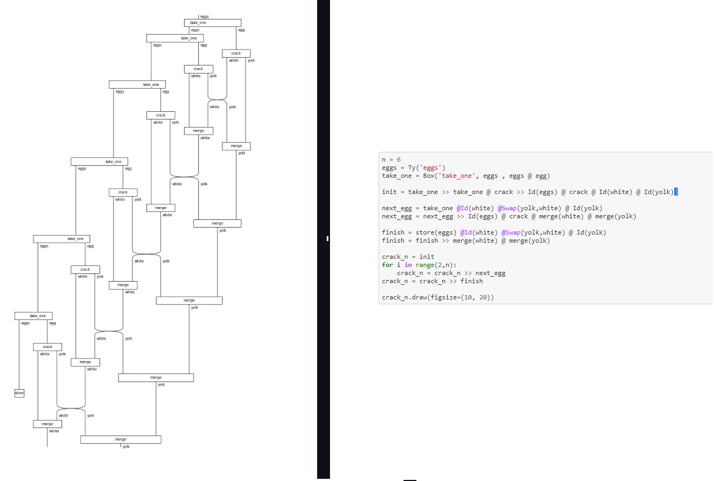

Our cascade and scalable egg york generation should resolve the challenges with large-egg process, and provide simple and compact solution for future multi-layer tiramisu generation. 

Another challenge for tiramisu generation was language barriers. A lot of recipes are based on English, and there is a lot of interest in building tiramisu in other platform in different language. As part of the localization project, we have developed our unique French to English translation where we can translate the recipe into French. 

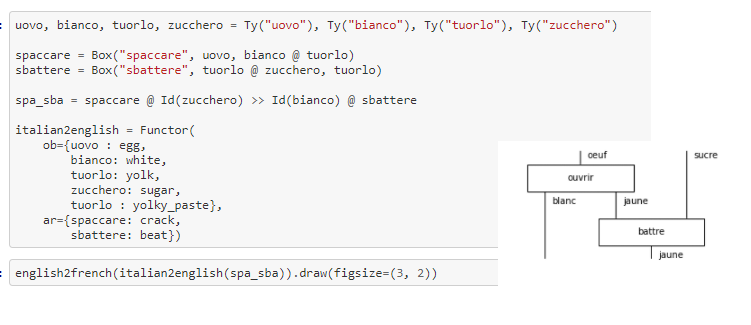

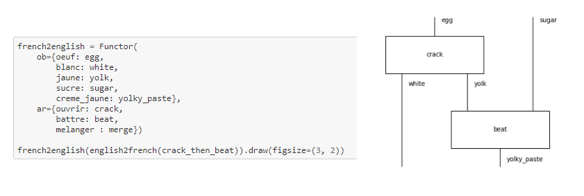

Our research is funded by international tiramisu & choc mousse Association (ITCMA). 

## Task 2

**Reference Code** :[Tutorial-Part2](qnlp-tutorial-Part2.ipynb)

We define a function that takes a number n and returns the diagram for a matrix product state (MPS) with n particles and random entries. We plot below on the left side how the evaluation time scales with the size of the diagram. We then compare that to the tensornetwork library and use it to contract the MPS diagrams more efficiently. This is done with the syntax diagram.eval(contractor=tn.contractor.auto).

<table align="center">
    <tr>
        <td>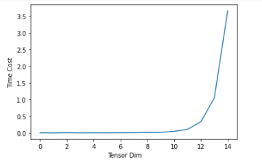</td>
        <td>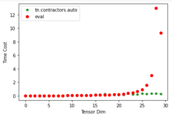</td>
     </tr>
 </table>
 
As we increase the tensor size, we can see exponetial increase of the time (left). On the right, we have used tensornetwork contractor to reduce the cost of time. From the green trace, we can see significant decrease of the time compare to the normal evaluation method shown in red.

### Task 3

**Reference Code** :[Tutorial-Part3](qnlp-tutorial-Part3.ipynb)

For this exercise, we implement three different circuits, bell state, GHZ state, and N-GHZ state. 

<table align="center">
    <tr>
        <td>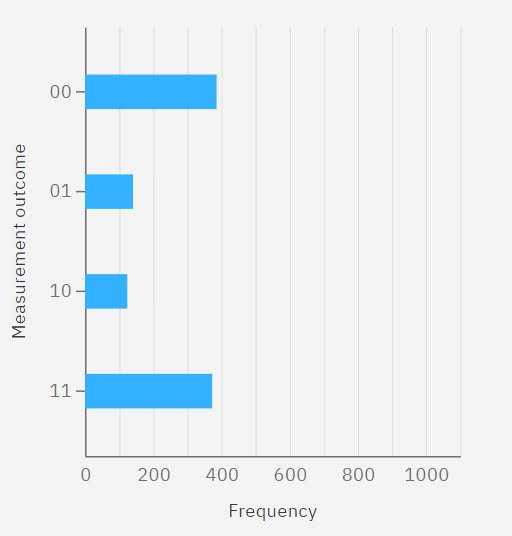</td>
        <td>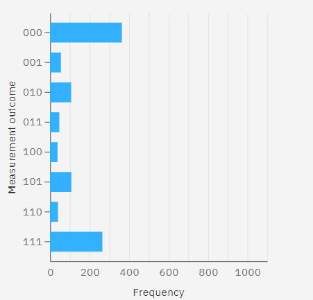</td>
        <td>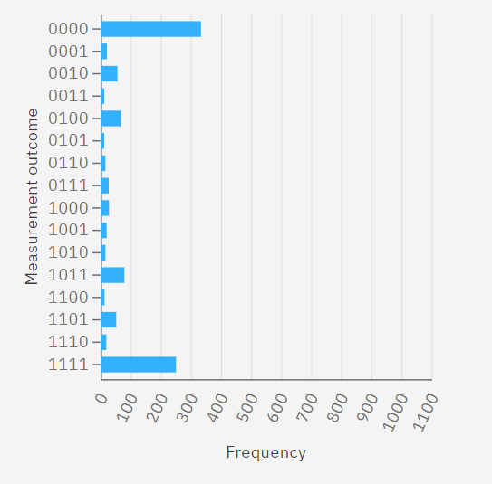</td>
     </tr>
 </table>
 
With help of a Real IBMQ machine, we were able to generate the probability distribution of those states. From quick calculation, we picked first |00...0> value to calculate the accuracy of the state.

| State | Accuracy  |
| :---: |  :---: |
| Bell |  81% |
| GHZ |  72% |
| 4-GHZ | 66% |

As we increase the number of qubits, some decoherence occurs and the accuracy goes down. 

## Task 4

**Reference Code** :[Tutorial-Part4](qnlp-tutorial-Part4.ipynb)

This task is about exploring more complex and different grammar structures.

First, we take a look at the Japense, we write the sentence Hanako ga tegami o kaita, which means Hanako has wrote a letter, [reference](https://aclanthology.org/Y07-1009.pdf).

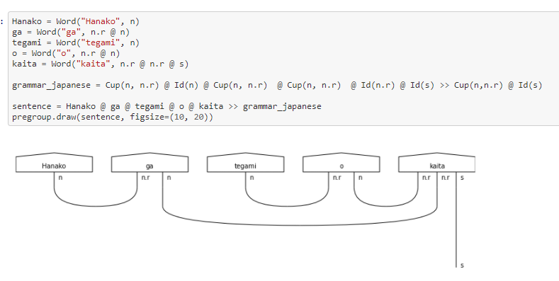

Secondly we look into arabic with the sentence ġadara ahmad al-madinah, which means ahmad left the city [reference](https://www.researchgate.net/publication/326268380_Parsing_Arabic_Verb_Phrases_Using_Pregroup_Grammars).

Then from Lambek's paper [From word to sentence](https://www.math.mcgill.ca/barr/lambek/pdffiles/2008lambek.pdf), we implement "I see you saw her", which we chose because of the nested sentence.

We now look at the task of text binary classification, we create a ver small semantic space made of true and false statements. 

Starting from the example Alice loves Bob, we expand our semantic space by including Charlie and Diane, and implement a love diagram inspired from the famous Shakespear play a midsummer nightdream, where Alice loves Bob who loves Charlie who loves Diane who loves Alice. We can evaluate a incomplete sentence and check it is equivalent to a word. 

## Task 5

**Reference Code** :[Tutorial-Part5](qnlp-tutorial-Part5.ipynb)

**table of contents**

1. To go back to the Readme [please click here](./README.md)
2. To explore Business use cases, please refer to the [Business Application found here](./Business_Application.md)
3. To explore the custom QNLP pipeline (Task 2 + Task 3), please refer to the [QNLP solution found here](./solutions_QNLP.md)
